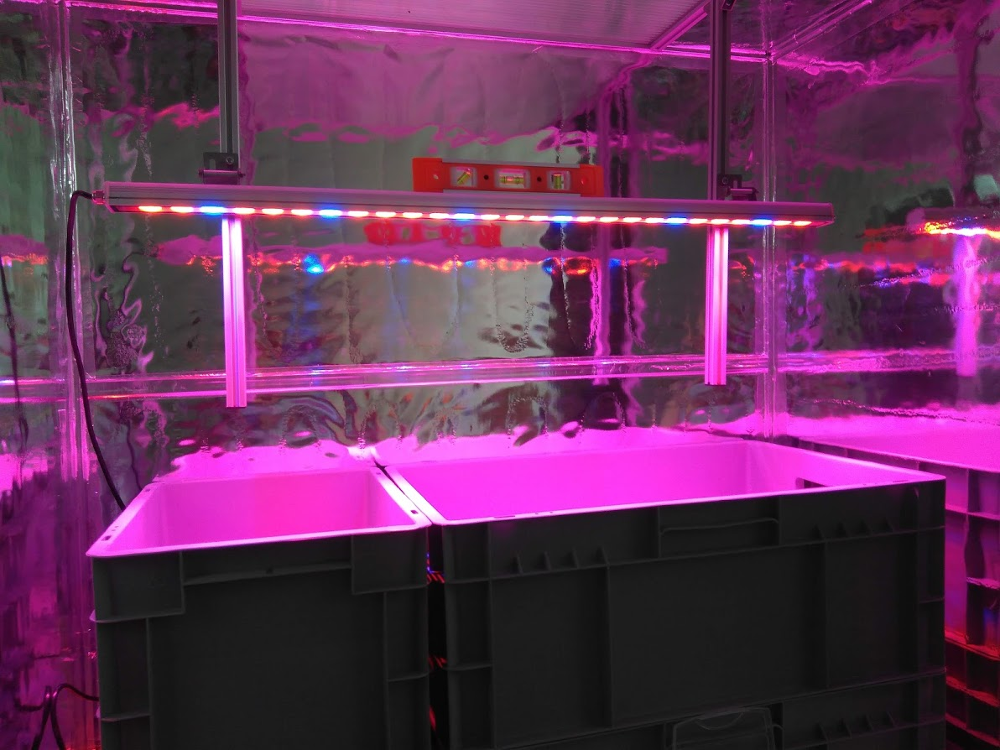

# Bastidor con perfiles de aluminio 50x100x100cm

Se trata de construir el bastidor con perfiles de aluminio **TSLOT** de 20x20mm y ranura de 6 mm. Se pueden comprar con  la longitud cortada a la medida que queramos, aunque es mejor usar valores mas o menos estandar. Estos perfiles son relativamente baratos, asi que **el coste total del bastidor es bajo, al tiempo que conseguimos una estructura ligera y rígida, con un aspecto muy profesional**.

Veamos en esta primera foto el aspecto que tiene el bastidor ya montado y abierto. Como vemos **se emplea un material reflectante diferente**.
Es un film grueso y aluminizado, muy eficaz para cultivos de interior. Tenemos la fijación de la luz que se puede regular en altura como en los otros modelos:

La barra lateral es la propia luz LED que en este caso tiene 85W. En la foto la vemos encendida:

La puertas, al ser grandes y para evitar problemas de peso, las he hecho en policarbonato alveolado. Es liviano y buen aislante térmico. Para fijarlo al chasis usamos una bisagra estandar con un acople impreso en 3D que he diseñado para este caso. Es la pieza blanca que vemos en la foto:

Las puertas las forramos internamente con film semireflectante y el perímetro en cinta de aluminio. El resultado, una vez colocado y con la luz encendida se ve de esta manera:

El resto de detalles constructivos son como el del FC 50x50x50 que ya se ha explicado.

