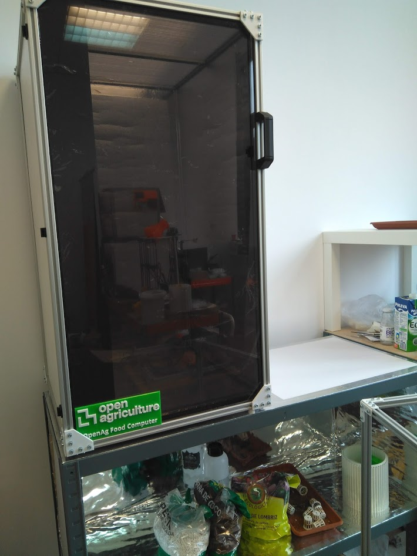
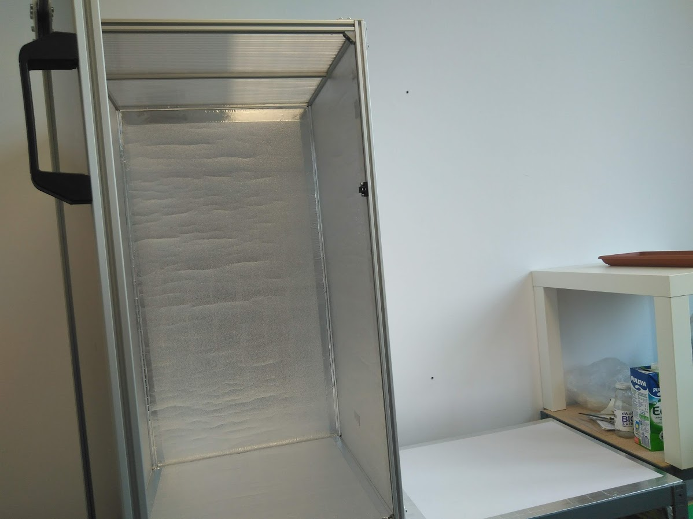
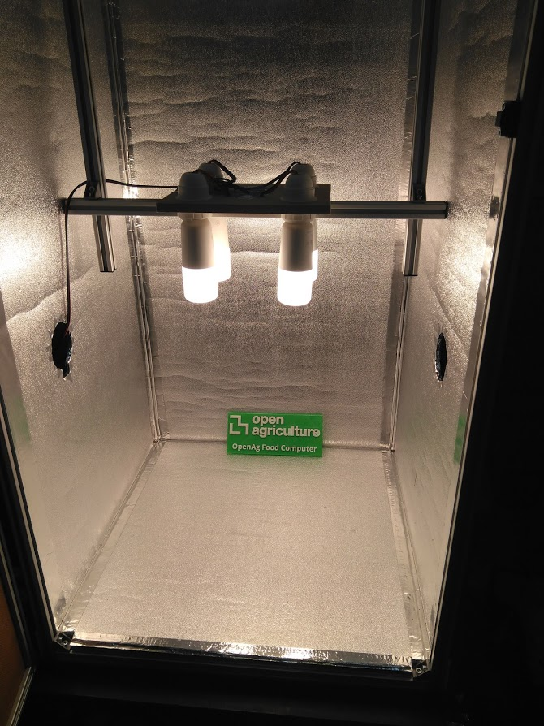
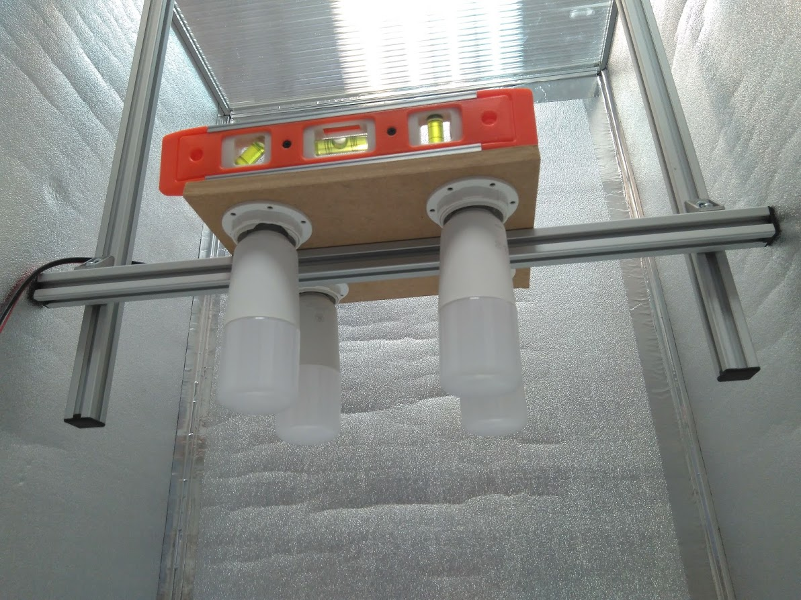
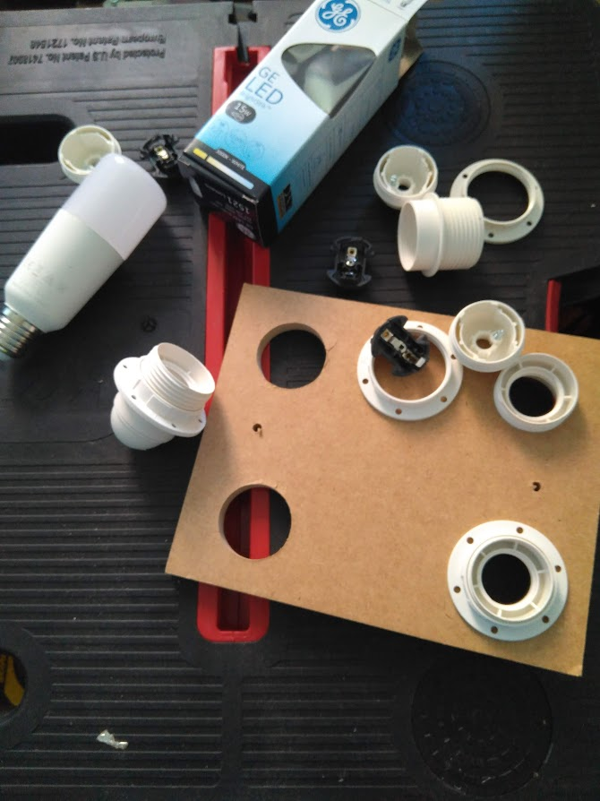
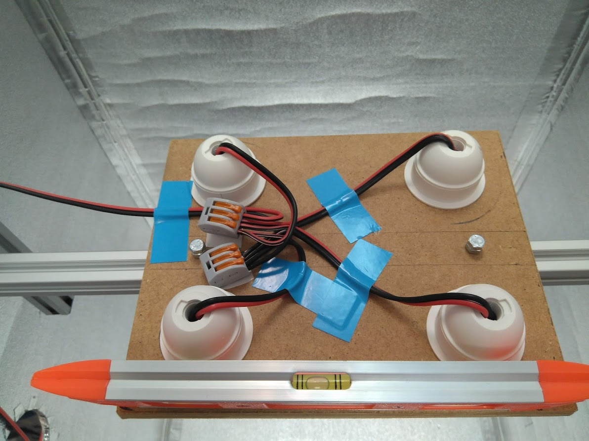

# Bastidor con perfiles de aluminio 50x50x100cm

Se trata de construir el bastidor con perfiles de aluminio **TSLOT** de 20x20mm y ranura de 6 mm. Se pueden comprar con  la longitud cortada a la medida que queramos, aunque es mejor usar valores mas o menos estandar. Estos perfiles son relativamente baratos, asi que **el coste total del bastidor es bajo, al tiempo que conseguimos una estructura ligera y rígida, con un aspecto muy profesional**.

Veamos en esta primera foto el aspecto que tiene el bastidor ya montado:

Con la apertura de la puerta vemos su interior. El sistema de montaje es como el del bastidor 50x50x50cm que ya hemos visto.

La iluminación en el interior es diferente. Para este caso hemos empleado el sistema de diseño del **Food Computer MVP** original, que emplea 4 bombillas LED de 16W. 

Aqui vemos el sistema desde abajo, está fijado a una barra que se puede levantar para estar a la distancia adecuada de las plantas:

Para hacerlo he empleado un trozo de mandera DM de 1cm, al que he hecho 4 agujeros para encajar el soporte de la bombilla. Estas dan una luz blanca de unos 3000K y 1500lm cada una.

Conectamos el cableado y lo fijamos a la placa en la parte superior, quedando de esta manera. Hay que ser muy cuidadoso en todo este proceso ya que estaremos trabajando con tensiones de 220AC.

El resto de detalles constructivos son como el del FC 50x50x50 que ya se ha explicado.

