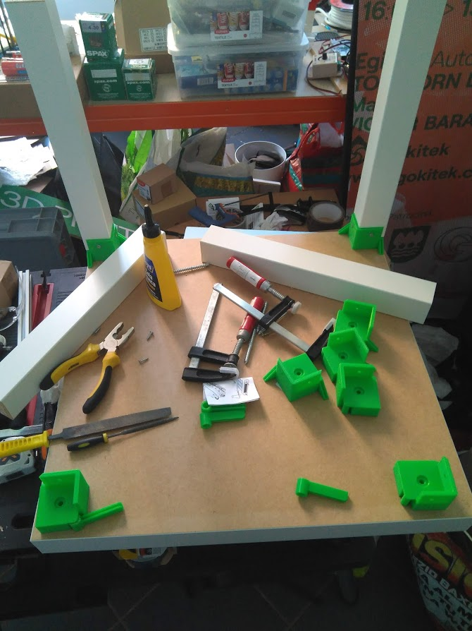

# Bastidor LACK

**A continuación mostraré como montar un bastidor de 50x50x50cm** con un kit de mesa de la casa IKEA,, llamado **LACK**. Tiene la ventaja de ser muy barato, unos 10euros. 

En la comunidad de impresión 3D surgió la idea de utilizar esta mesa para recubrir las impresoras. Si se panelan permiten crear un espacio cerrado de temperatura estable, que permite imprimir ciertos materiales difíciles como el ABS. Para hacerlo posible se diseñaron unas piezas que permiten que todo el conjunto encaje correctamente y cumpla esa función. He incluido esas piezas en el proyecto (en la carpeta STL) y he añadido una subcarpeta adicional con mis propios diseños para adaptar el diseño y asi sirve como Food Computer.

Aquí vemos el inicio del ensamblaje:

La mesa se compone de las 4 patas y el tablero. Las unimos entre si con una pieza impresa entre ambas, luego veremos para que sirve. Empleamos cola blanca y tornillos de 4x40. Las patas se pueden fijar lateralmente a la pieza en 3D en los dos lados interiores. Para esta unión lateral se usan tornillos mas pequeños de 3,5x16. Vemos todo esto en la foto.

Una vez montadas las patas y antes de fijarles la base colocamos los paneles laterales. Deben tener un espesor de 2,5mm aproximadamente para que entren en unos insertos que tienen las piezas en 3D. En mi caso he usado para el panel trasero una placa de madera DM plastificada en blanco (e internamente cubierta de aluminio). Esta placa tiene 3mm y la he tenido que rebajar un poco para que entre en los insertos.

Las placas laterales son de plástico de 2,5mm asi que entran correctamente. Ambas están recubiertas internamente de film semireflectante para evitar la pérdida de la luz interior y reducir el deslumbramiento cuando miramos al equipo. Deben tener dos agujeros circulares de unos 8cm de diámetro, que servirán para la entrada y salida de aire. Uno de ellos debe estar alineado con la placa de control que estára en el exterior. En la foto que sigue vemos el aspecto que tiene:

Nos queda la puerta. También es de plástico y 2,5mm. Internamente forrada de film semireflectante y aluminio como vemos en la foto:

En la parte frontal lleva una franja de film blanco. Todas las aristas están forradas con cinta de carrocero verde. En la foto vemos el aspecto que va a tener:

En este caso vemos que se forman burbujas al colocar el fim semireflectante ya que es muy fino, no lo recomiendo. En el futuro prefiero comprar si es posible   el plástico ya tintado a un proveedor especializado.

La base del bastidor será una plancha de madera DM de 1cm y aproximadamente 50x50cm . La forraremos con film blanco y la fijaremos al resto del chasis con cola blanca y tornillo de 4x40 . Este es el aspecto que tiene:

El aspecto del bastidor terminado es este. La puerta inserta en las ranuras de las "bisagras" que van insertas en las piezas en 3D (estas piezas van tanto arriba como abajo para sujetar la puerta desde ambos puntos). En las juntas de unión de los paneles podemos aplicar silicona blanca  para que el sellado sea bueno. También se puede poner un burlete en la puerta.

Este bastidor es de 50x50x50 que es un tamaño bastante apto, pero podemos hacer un bastidor de 50x50x100cm para cultivos mas grandes si unimos dos mesas LACK. Una abajo y dada la vuelta y otra arriba. O sea, la plancha de la mesa hará de base en la mesa de abajo. Para unir ambas mesas en su sección central (pata con pata) he diseñado unas piezas adicionales en 3D como está que vemos aquí:

El panel LED en el interior lo fijamos mediante tornillo, pero debe guardar cierta distancia para permitir su refrigeración. He usado tornillos de 4x40 y unas tuercas para que hagan de separadores, como vemos en la foto. 

 Y ya está. A esto hace falta añadirle la placa de control (brain) pero eso lo vemos en otra sección.

