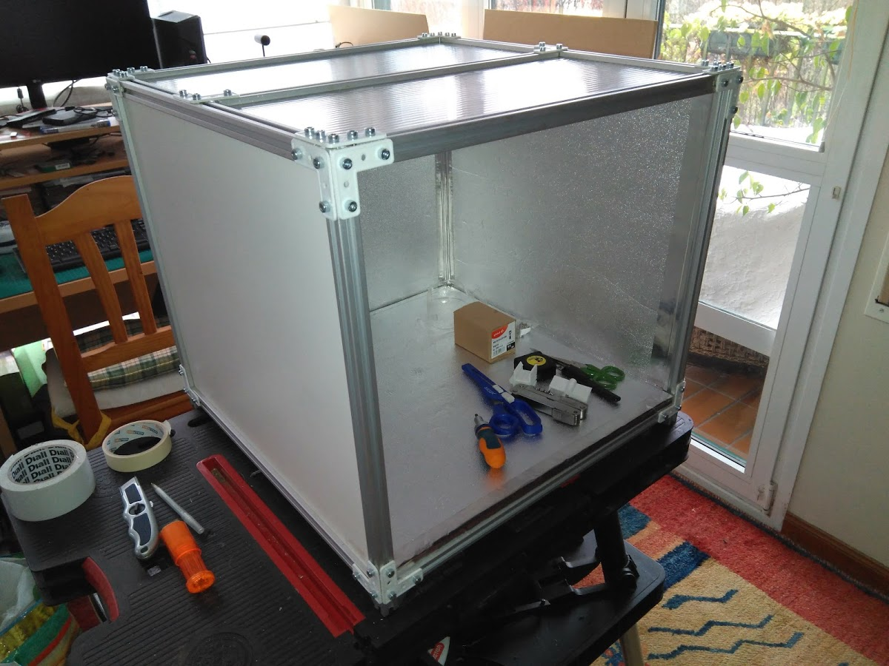

# Bastidor con perfiles de aluminio

Se trata de construir el bastidor con perfiles de aluminio **TSLOT** de 20x20mm y ranura de 6 mm. Se pueden comprar con  la longitud cortada a la medida que queramos, aunque es mejor usar valores mas o menos estandar. Estos perfiles son relativamente baratos, asi que **el coste total del bastidor es bajo, al tiempo que conseguimos una estructura ligera y rígida, con un aspecto muy profesional**.

**A continuación mostraré como montar un bastidor de 50x50x50cm** pero modificando las dimensiones se puede hacer d elas dimesniones que se quiera, de hecho he construido otros dos de 50x50x100 y 100x50x100 para probar diferentes factores de forma y comparar los resultados. Si quieres ver fotos de los mismos los tienes aquí:

[MVP de aluminio 50x50x100](Bastidor_50x50x100.md)

[MVP de aluminio 50x100x100](Bastidor_50x100x100.md)

Veamos en esta primera foto el aspecto que tiene el bastidor:

Como es un cubo tenemos 12 piezas de 50cm, mas otra situada en la mitad de la cara superior y que sirve para "atar" cosas internamente. Veremos eso mas adelante. Asi que **tenemos un total de 13 piezas de 50cm**.

**La unión entre aristas se hace mediante unas piezas impresas en 3D** en forma de L o de T, con tornillos de 5x8mm y tuercas martillo de 5mm.

**Las facetas se cubren con dos capas de material** unidas con cinta adhesiva de doble cara. Las dos capas son las siguientes:

- Capa de **madera DM de 3mm**, con un lado plastificado en blanco.
- Capa de **poliestireno de 3mm**, con una capa cubierta de aluminio mate ( este material se usa para aislamiento en radiadores)

Ambas suman unos 6mm asi que insertan en la ranura correctamente, se meten desde arriba con la arista superior quitada y luego se fija, quedando la faceta integrada con las aristas. Si vemos un poco de holgura podemos meter trocitos de madera DM o de poliestireno que han sobrado desde el interior, a modo de cuña, en la ranura y asi quedará perfecto.

**La parte superior está hecha de dos piezas de policarbonato alveolar**, que es transparente y permite el paso de la luz. Asimismo proporciona un buen aislamiento térmico debido a los alvéolos de aire que tiene en su interior.

**La base debe ser resistente al peso, para ella empleamos un trozo de madera DM de 1cm** de espesor, cubierta con el mismo poliestireno aluminizado de 3mm.

Rematamos las aristas en el interior con un poco de cinta adhesiva de aluminio y nos queda el aspecto que vemos en la foto.

En el frontal ponemos un poco de burlete para sellar el cierre de la puerta, como vemos en la foto que sigue. 

**La puerta es de metacrilato de 4mm** en este caso al no ser muy grande la hacemos de esta manera. **Tiene  el lado interior recubierto de film semireflectante** para que la luz rebote en el interior y se aproveche mejor, asi como para evitar el deslumbramiento, ya que la luz que tendremos en el interior es muy brillante. Las aristas estan recubiertas de cinta de aluminio. Unos agujeros pasantes nos permiten fijarla con bisagras, poner el mango y unos imanes para el cierre, quedando de esta forma completamente funcional. 

Hablaremos mas adelante de la electrónica que debemos tener, tanto dentro como fuera, pero en la foto que sigue vemos el aspecto de la máquina una vez terminada y conectada. El color morado tirando a rosa es hipnotizante:

También hablaremos en otro momento del software, su instalación y características, en la foto que sigue lo vemos ya registrando datos:

