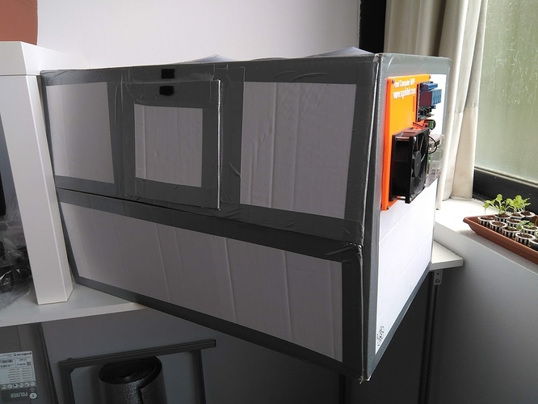
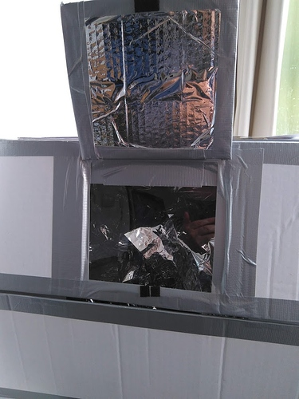
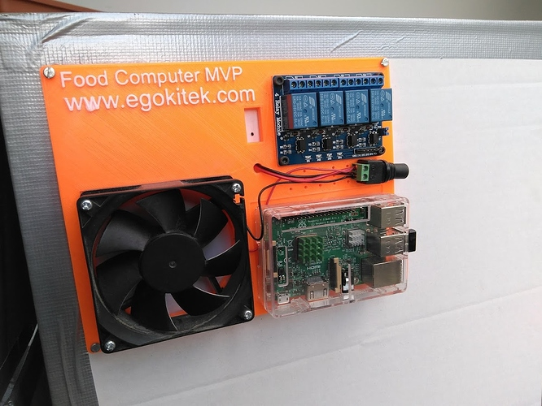
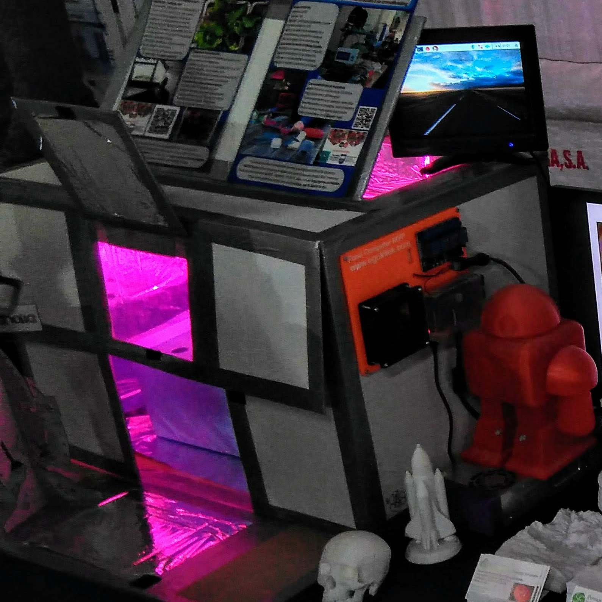

# Bastidor con caja de carton

## Dimensiones de 60x40x40 cm

**Se puede hacer un bastidor de Food Computer con algo tan simple como una caja de carton**, si el objetivo es ahorrar en coste el máximo posible. Debe ser una caja lo bastante grande y bien conservada. En este ejemplo he empleado una caja de 60x40x40 cm, que externamente es blanca y resulta mas estética.

**Para reforzarla ponemos cinta americana en todas las aristas**. Esto tambien mejora su aspecto estético, hemos de ponerla con un poco de cuidado para que quede bien.

**Cortamos con un cutter un hueco tanto en la parte superior como uno mas pequeño en el frontal**. En ambos ponemos un trozo de plástico que podemos reusar de algun embalaje. Si lo hemos de comprar hablamos de un plástico acrílico o metacrilato, de espesor fino, 1-2mm. Los fijamos mediante cinta americana.

**El interior de la caja debe forrarse con material reflectante**. Podemos usar **papel de aluminio** pero se rompe con facilidad. Es mejor usar una toalla de supervivencia, son muy baratas (unos 3eur), están hechas de un material llamado **Mylar**, es un plástico muy fino y aluminizado. Lo pegamos mediante cola blanca o cinta de doble cara. Es un material un poco dificil de manipular y es casi inevitable que aparezcan pliegues, pero es muy reflectante y también barato.

Los dos trozos de cartón que hemos cortado previamente los forramos también de mylar y los fijamos a al caja, usando cinta americana a modo de bisagra.

**Para abrir o cerrar las dos compuertas** que acabamos de describir usamos un trozo de **velcro**. En la foto que sigue a continuación vemos la caja terminada:

Los dos pequeños cuadros negros en el frontal son las piezas de velcro, sirven para mantener abierta la ventana frontal cuando la levantamos. En la siguiente foto lo podemos ver:

**La tarjeta de control** la podemos fijar atrás o en un lateral, en este caso se ha fijado en el lateral derecho. No pesa mucho y no afecta a la integridad de la caja. La tarjeta que se muestra era una primera prueba de concepto y está en evolución, no es el aspecto que tendrá finalmente.

El inconveniente de usar un bastidor de este tipo es que **es díficil de fijar la luz en el interior**, además hemos de tener en cuenta que disipa una cierta cantidad de calor. Estoy probando diferentes soluciones y para este tipo de bastidor no he encontrado todavía la mas satisfactoria. Cuando lo haya testado actualizaré esta información.

**La caja terminada, con su ordenador Raspberry Pi conectado a teclado y monitor externo, y con la luz encendida tiene este aspecto**. Esta foto fue tomada en la Bilbao Maker Faire de Diciembre de 2017, donde expuse este bastidor como prueba de concepto.

