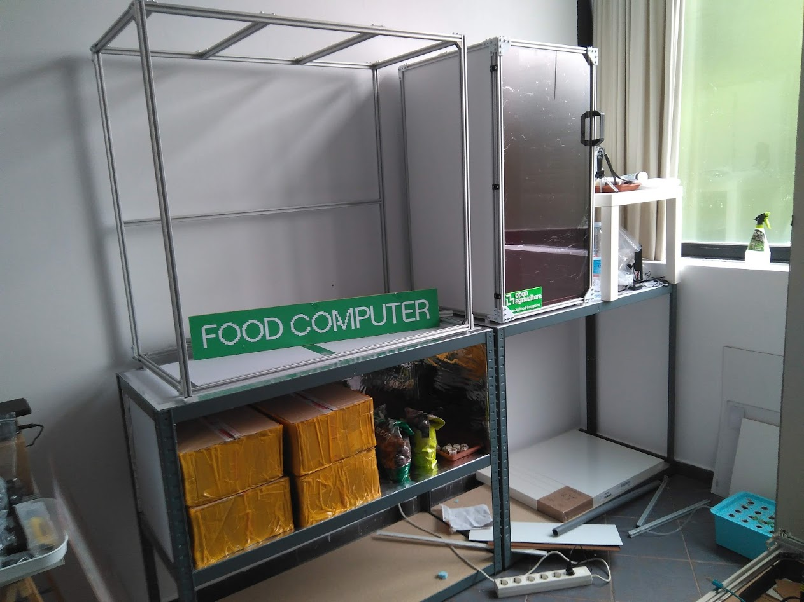
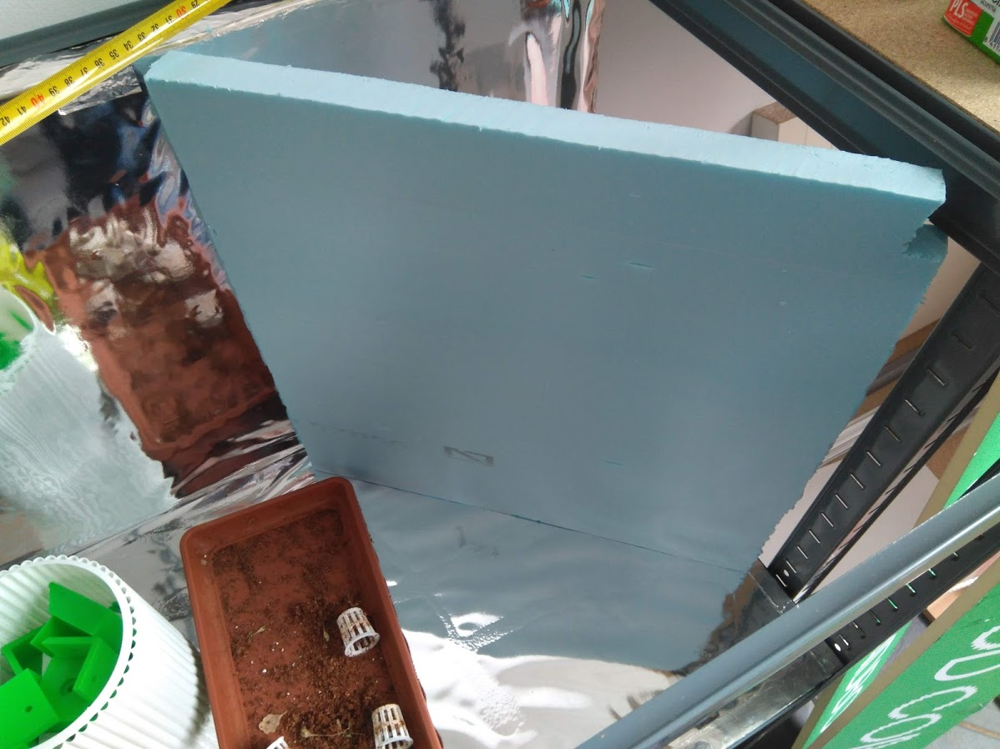
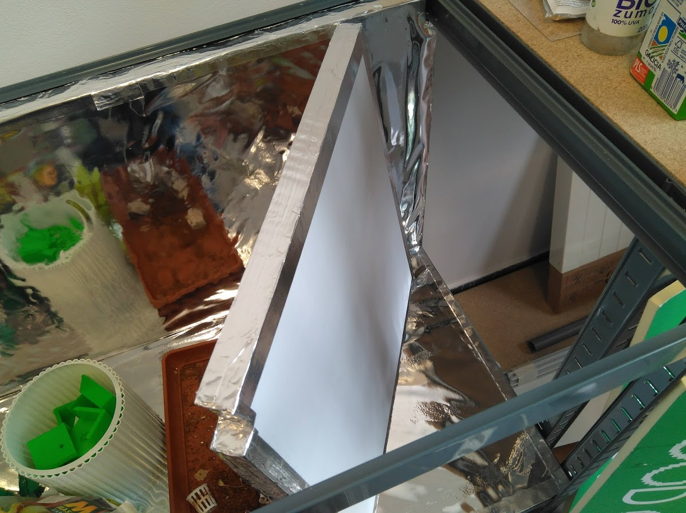
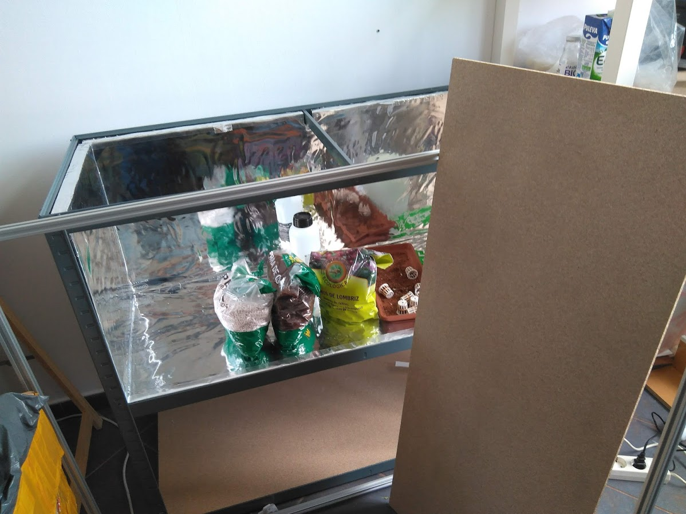
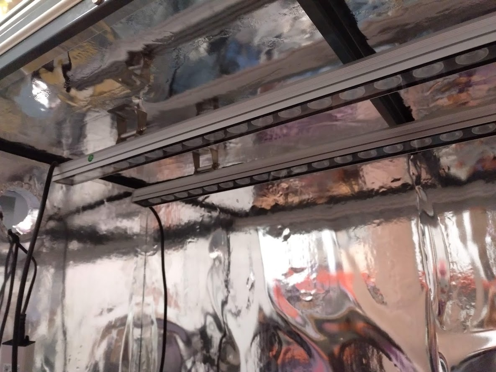
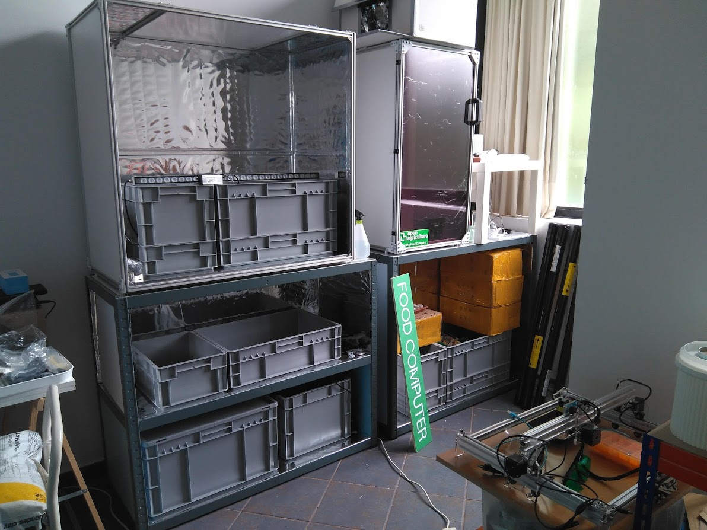
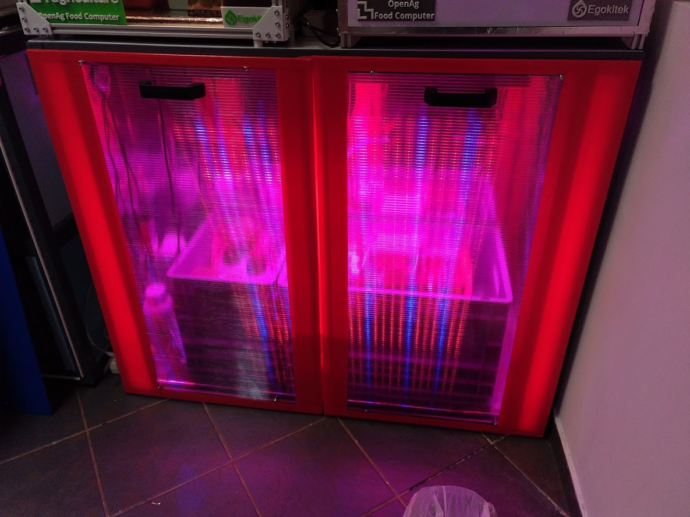

# Bastidor a partir de estanterías metálicas

En este caso construimos un **bastidor con una estantería metálica** de venta en cualquier ferretería o centro de bricolaje y la forramos con paneles que pasamos a describir.

La estantería de **este caso es de 120cm de ancho y 50cm de fondo**. el coste fue de unos 60euros. Se puede partir en dos módulos, quedando uno diáfano (el de la dcha) y otro con una división interior (el de la izda.) De este modo tenemos un ancho total de 220cm y una altura de 90cm. En la foto lo podemos ver antes de panelar:

Los **paneles tanto laterales como traseros** los hacemos con **poliestireno extruido** (no expandido, este es el porexpan o corcho blanco, mucho mas frágil). Un panel de este tipo cuesta unos 4-5eur (120x60cm). Es fácil de cortar con cutter a la medida que necesitamos. En la foto vemos el trasero colocado y el lateral derecho a punto de colocar. entran a presión, no hace falta que esten pegados.

Cada una de estas placas la forramos internamente con plástico aluminizado y externamente con film blanco adhesivo. En el perímetro pegamos cinta de aluminio. En la foto vemos el mismo panel lateral ya preparado y a pounto de colocar:

**Las planchas de madera que lleva la estantería** las forramos de plastico aluminizado en sus caras interiores. En su cara superior, la que queda a la vista, de film blanco adhesivo.

Una vez forrado todo el interior **colocamos las barras LED** en su parte superior. El módulo diáfano tendrás dos barras, mientras que el doble tendrá solo una en el nivel superior. El nivel inferior tendrá depósitos de líquidos ya que en este módulo emplearemos la técnica ebb&flow de la que ya hablaremos en el apartado de cultivo. Las barras LED tienen 85W cada una. Las fijamos al panel mediante hembrillas tal y como se ve en la foto:

En estos MVPs empleremos la técnica **ebb&flow** y mas adelante **cultivo de alga spirulina** e incluso quizás un **pequeño módulo acuapónico**. Para todo ello emplearemos unas cajas de uso alimentario que se pueden apilar. Hay dos niveles, el superior contendrá el sustrato y el inferior el líquido para el riego, que se movera de forma periódica con una bomba. En la foto vemos estas cajas  en su proceso de colocación. Falta la fontanería necesaria para que el bombeo funcione. 

Y por último una prueba de encendido con uno de los módulos. **Las puertas son grandes** y por tanto también **de policarbonato alveolado**. Forrado internamente de film semireflectante y con perímetros de cinta de carrocero. En un módulo a rojo y en el otro en azul.

En otros apartados del proyecto se explican el resto de detalles.

