# Cultivo

Se puede cultivar en distintos medios: 

- Suelo "normal" o modificado, pero sólido. **Es el de mi preferencia**.
- Suelo líquido: **hidroponía** . Existen múltiples técnicas, en este proyecto usaremos **DWC** y **ebb&flow**
- Suelo "gaseoso": **aeroponía**, que queda fuera de este proyecto ...  de momento). En este caso se usa una niebla fina de agua mas nutrientes, mediante atomizadores.

El **cultivo hidropónico y aeropónico permite velocidades de cultivo mas altas** y elimina muchos de las plagas por la razón de que no hay un suelo sólido en el que puedan anidar. Muchas plagas en al menos alguna fase deben estar en el suelo. **El incoveniente es que hay que medir de forma frecuente** ciertos parámetros del líquido y debe añadirse lo que le falta. Si no, **el cultivo puede echarse a perder rápidamente.**

**En fincas o instalaciones grandes** donde estas mediciones y dosificaciones se pueden automatizar, y donde se busca la producción alta, **el cultivo hidropónico puede merecer la pena**. **Mi opinión personal es que en instalaciones pequeñas no totalmente automatizadas es mejor usar un medio sólido**. La producción será mas baja pero mas fácil de que llegue a buen término porque si el suelo está en condiciones entregará a la planta todo lo que esta necesita sin necesidad apenas de intervención.

En mi caso he probado varias técnicas porque quiero documentar mínimamente cada una de las fórmulas de cultivo a pequeña escala en un Food Computer.

Paso a explicar entonces los distintos medios.

## En sustrato sólido

He empleado una mezcla de 3 componentes: 
- compost de lombriz
- perlita y/o vermiculita
- fibra de coco

Esto se asemeja al sustrato propuesto en el **método del metro cuadrado** : es un medio sólido, ligero y cargado de nutrientes, con buena aireación y retención del agua. En la foto vemos un cultivo de albahaca en su momento de brotación. Lo iluminamos con luz blanca para comprobar como la planta es verde. Ya que con luz morada se ve de tono oscuro, porque no hay luz verde que la planta puede reflejar.

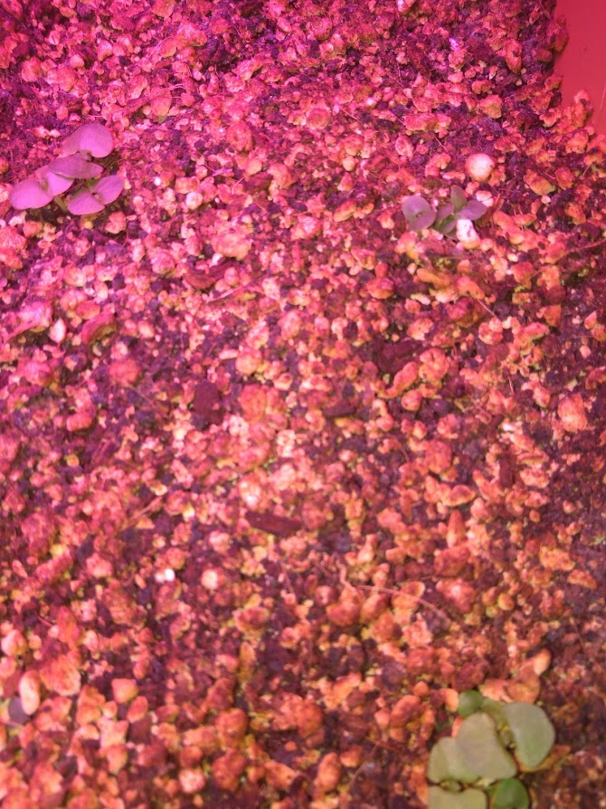

Aquí vemos las albahacas cuando ya han crecido, expuesta un momento a la luz del día para ver que son completamente verdes, como no podía ser de otra manera:

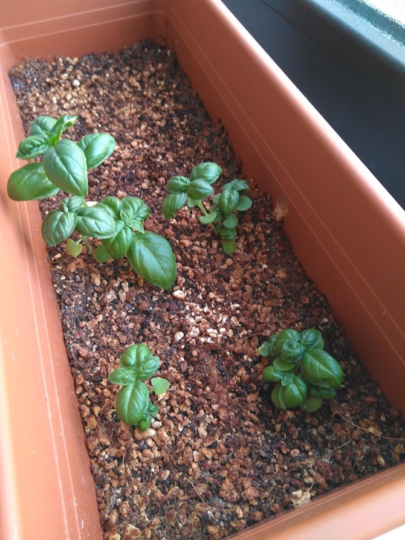

Y aquí vemos lechuga y hoja de roble creciendo en el mismo medio sólido:

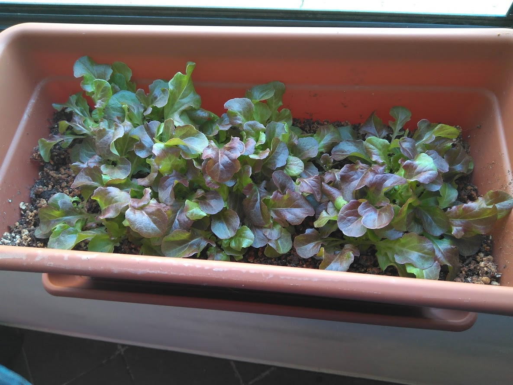

## Hidroponía: técnica DWC

DWC significa **Deep Water Culture** y consiste en cultivar en una cubeta llena de agua con los nutrientes. Las raíces siempre están sumergidas en agua, para evitar su asfixia el agua se mantien oxigenada mediante una pequeña bomba de acuario. Esta técnica vale para plantas de pequeño tamaño y crecimiento rápido. Idealmente la mayoría de verduras de ensalada: lechuga, rúcula, canónigo etc.

La base de la planta está alojada en un pequeño cesto insertado en la tapa de la cubeta. Este cesto si contiene un medio sólido donde se coloca la semila para que germine y se desarrolle, de tal forma que las raíces alcanzan el medio líquido y crece a través de el. 

- **Si colocamos en una tapa** se debe vigilar que el nivel de líquido va bajando y se debe reponer, menteniendo la concentración adecuada de nutrientes.
- **Otra manera es colocar una placa de material que flote** y en el van los cestos, normalmente de poliestireno extruido. En este caso aunque el nivel baje las raíces siguen en contacto con el líquido. Hemos de cuidar también el nivel pero no hace falta tener tanto celo.

En la foto que sigue vemos los cestos y el medio sólido empleado, en mi caso he usado fibra de coco pero hay otras soluciones.

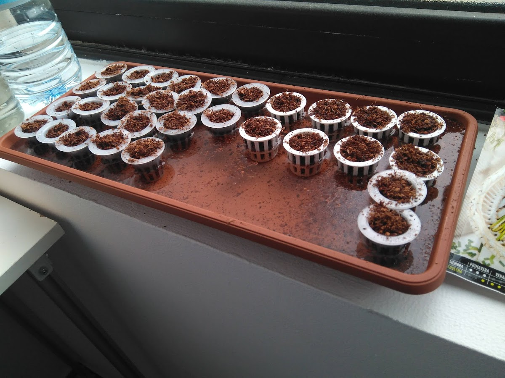

La planta brotará y crecerá con normalidad como vemos aquí. Podemos ver que esta cubeta tiene bastante agujeros, concretamente 24. En mi experiencia he visto que es mejor tener menos, de 6 a 12. Para evitar la entrada de luz en esos agujeros (puede provocar que se formen algas) se pone un material completemente opaco, como retales de plastico aluminizado.

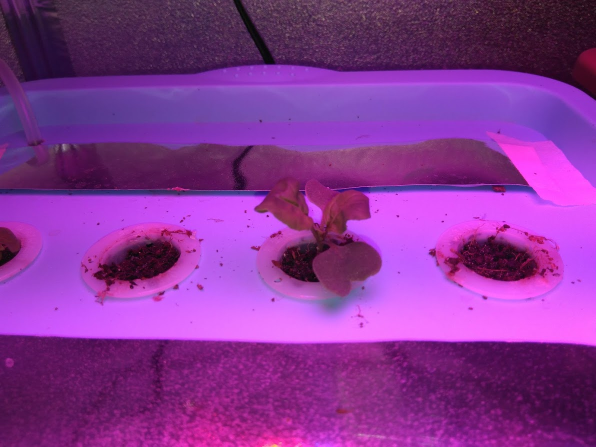

Pasado un tiempo podemos ver el sistema radicular flotando en el agua si levantamos la tapa, tal y como vemos en esta foto:

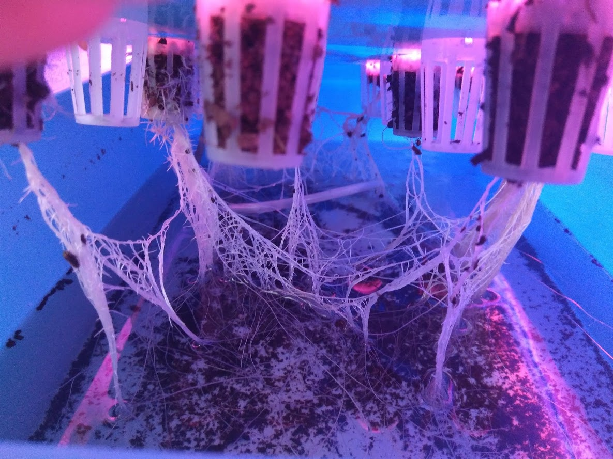

Aquí vemos el cultivo bastante desarrollado, tanto en medio sólido como DWC: 

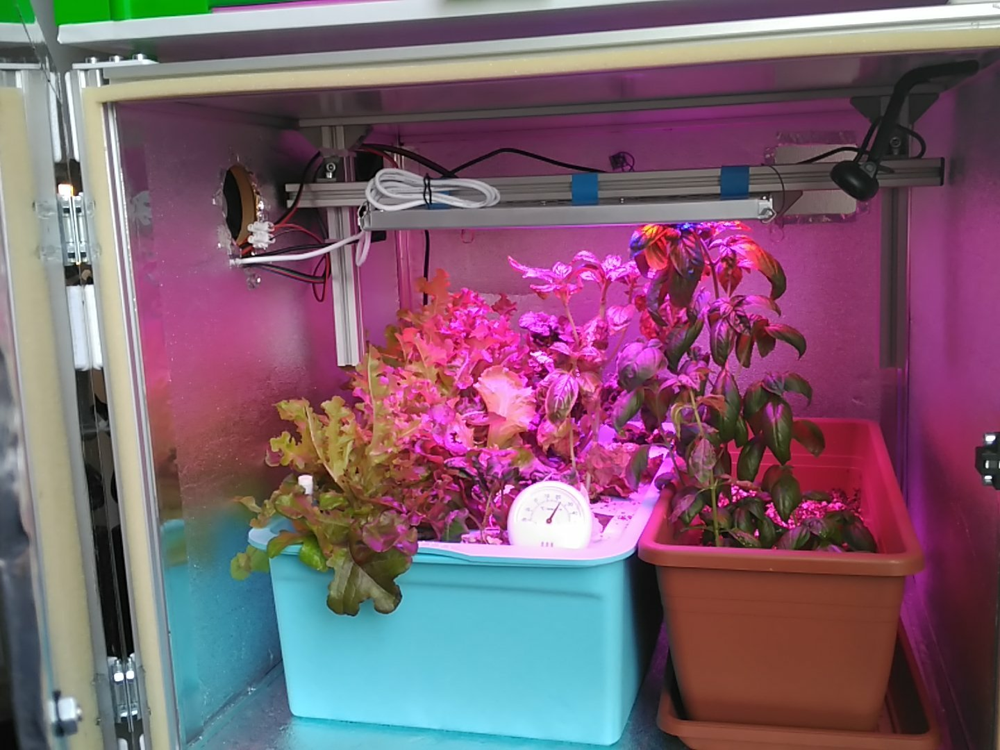

Por este sistema se pueden cultivar plantas de mayor porte como tomates, berenjenas o pimientos, pero requieren entutorado. Aquí vemos algunas fotos:

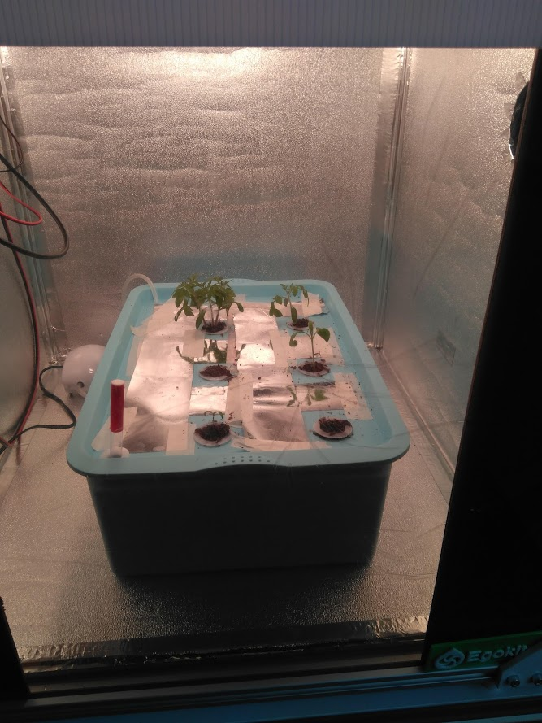

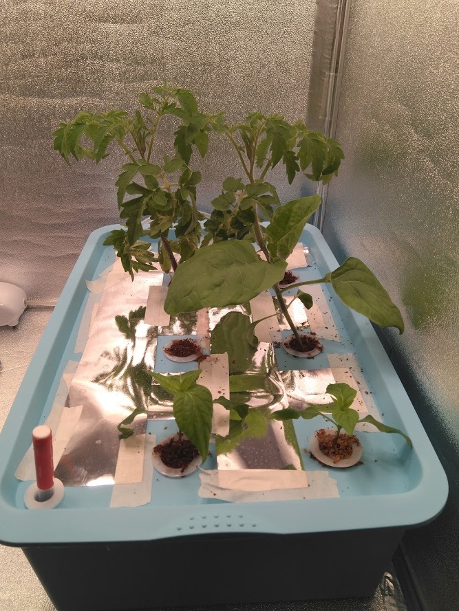

## Hidroponía: técnica Ebb&Flow

**En proceso de pruebas y documentación**

## Hidroponía: instrumentación necesaria

Para cultivos a pequeña escala necesitamos fundamentalmente dos instrumentos:

- Medidor de **pH** :  De su valor óptimo depende que las plantas puedan absorber las sales minerales y los nutrientes necesarios.
- Medidor de conductividad **EC** : indica el nivel de concentración de nutrientes disueltos en el agua.

Aquí vemos ambos medidores, existen en el mercado equipos bastante baratos, en la banda de los 25euros:

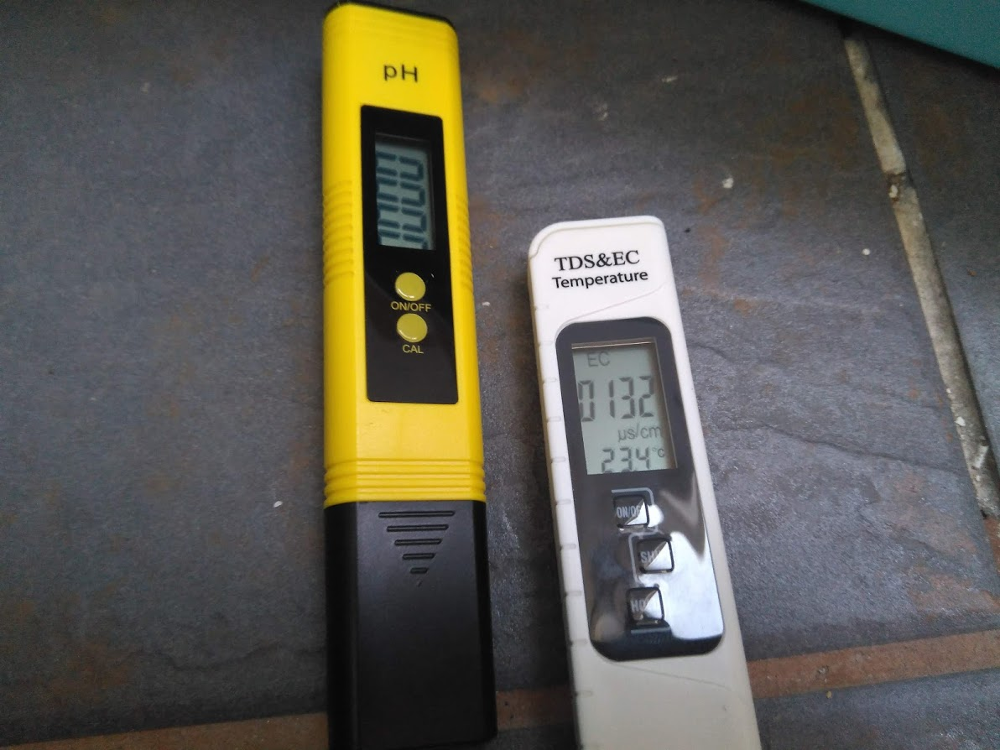

**La preparación del medio de cultivo** se hace añadiendo la dosis exacta de material sólido que se debe disolver en el agua, de tal forma que los valores de ph y conductividad sean los correctos. Normalmente se emplea una solución **A+B** (así se llama), que contiene todas las sales necesarias, unas 17, las que la planta necesita para crecer. Esta solución se vende en diferentes cantidades.

En mi caso y con el sobre plastificado que se ve en la foto se prepara una botella de 1,5l. Asi que vale con cualquier botella estandar de agua. Es importante protegerla de la luz y agitar bien siempre antes de utilizar. Para hacerla opaca he empleado cinta de carrocero gris. El líquido que queda es de color morado, se ve en el vaso dosificador. Una botella de 1,5 litros permite preparar 200 litros de agua para cultivo. En esta cubeta caben unos 10l. asi que con el contenido del vaso es suficiente.

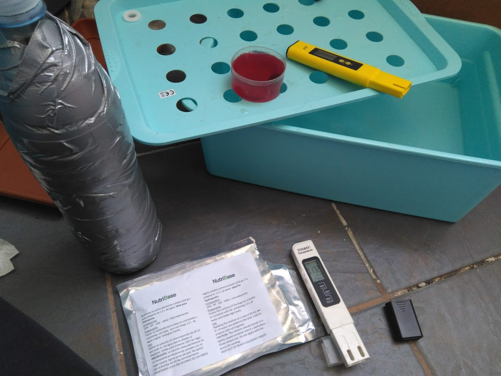

Hemos de vigilar el nivel de líquido de la cubeta y reponerlo periodicamente, asi como vigilar los valores de EC y PH con una frecuencia mínima semanal. Se recomienda vaciar la cubeta y reponerla entera con la dosificación correcta para garantizar que las concentraciones de nutrientes son los adecuados.
