# Iluminación LED

**Se han testeado diferentes fórmulas para uso de LEDs en el cultivo.**

- Paneles matriciales de diferentes potencias

- Tiras de LED

- LEDs de tipo COB (espectro total)

- Montajes DIY a la medida

- Cuestiones de refrigeración

- PAR, Lumen, Lux, umol ... La cuestión de la eficacia luminosa y como medirla.

### Panel DIY con modulos COB de 10W a 12 Voltios DC

Esta fórmula es interesante ya que es barata y trabaja a 12V de continua, que permite una utilización directa con instalaciones de energía renovable. La pega es que al hacer las soldaduras de forma manual existe mas posibilidad de averías. Puede llegarse a quemar algún componente y tratándose de equipos que van a funcionar desatendidos durante muchas horas no lo recomiendo en absoluto.

### La seguridad ante todo

Aquí vemos dos LED con dos pequeñas placas que bajan la tension de 12 a 9V para que no se calienten tanto. Todo el conjunto está pegado a una barra de aluminio que actua como disipador y además lleva detrás un ventilador. Aún con todo se calientan mucho. **Para jugar y experimentar está bien pero insisto no recomiendo esta vía.**

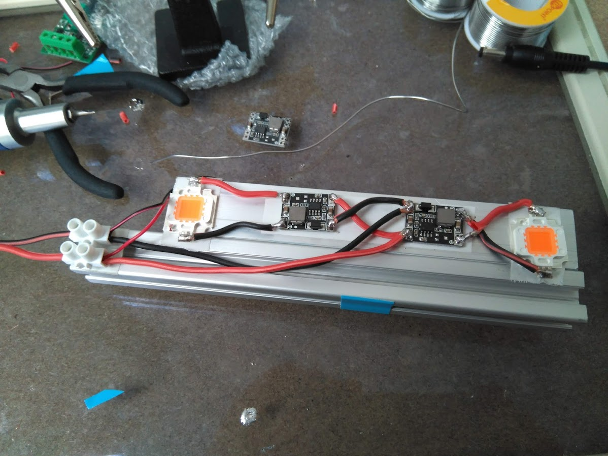

Aquí vemos dos COB de luz blanca:

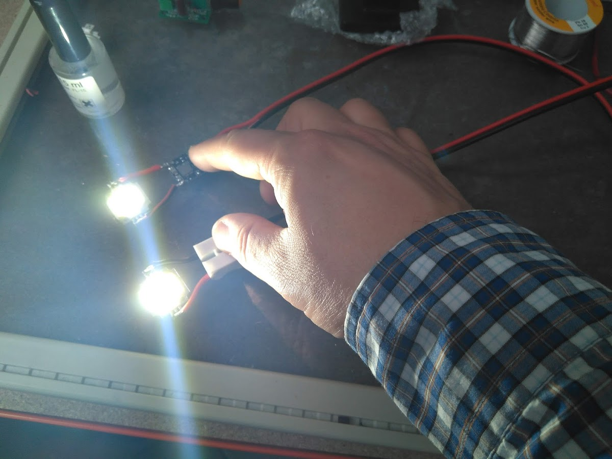

Y aquí uno de luz azul-roja que da el color morado:

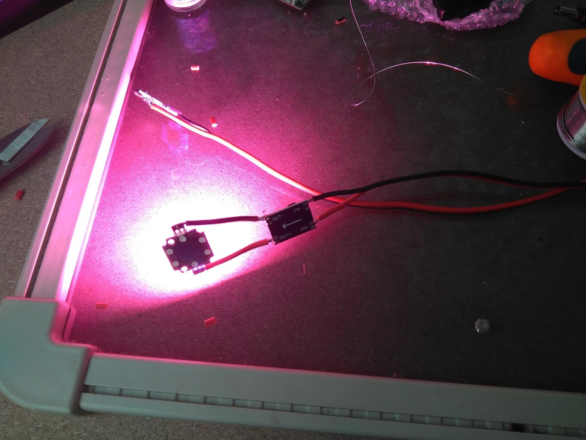

en esta foto podemos apreciar que el conjunto es realmente luminoso:

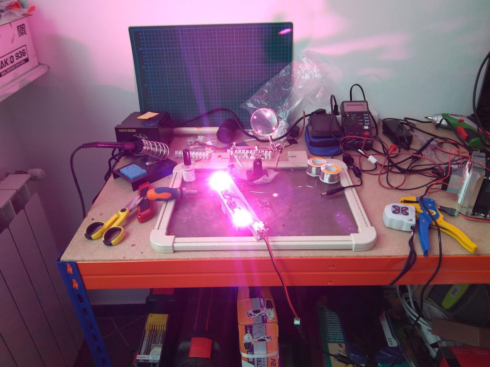

### Panel comercial de 40W a 220V Voltios AC

Este panel consume tan poco que para disipar el calor le basta con la plancha trasera de aluminio. Trabajan a unos 35V de continua, es lo que ofrece su propia fuente de alimentación.

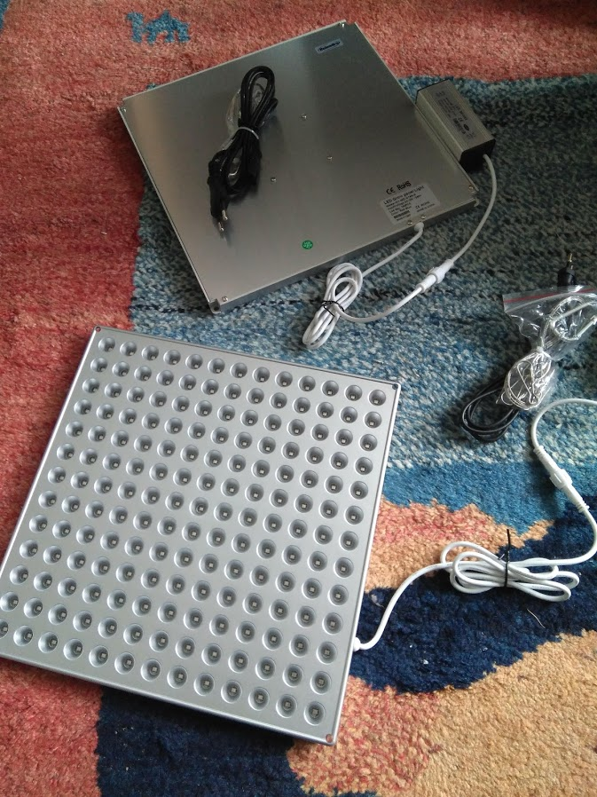

Una prueba de endendido:

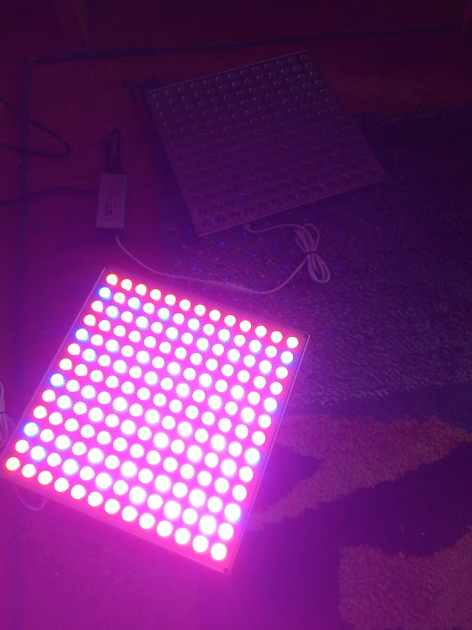

En esta foto vemos la combinación de colores, en estas placas es estrictamente rojo-azul. 

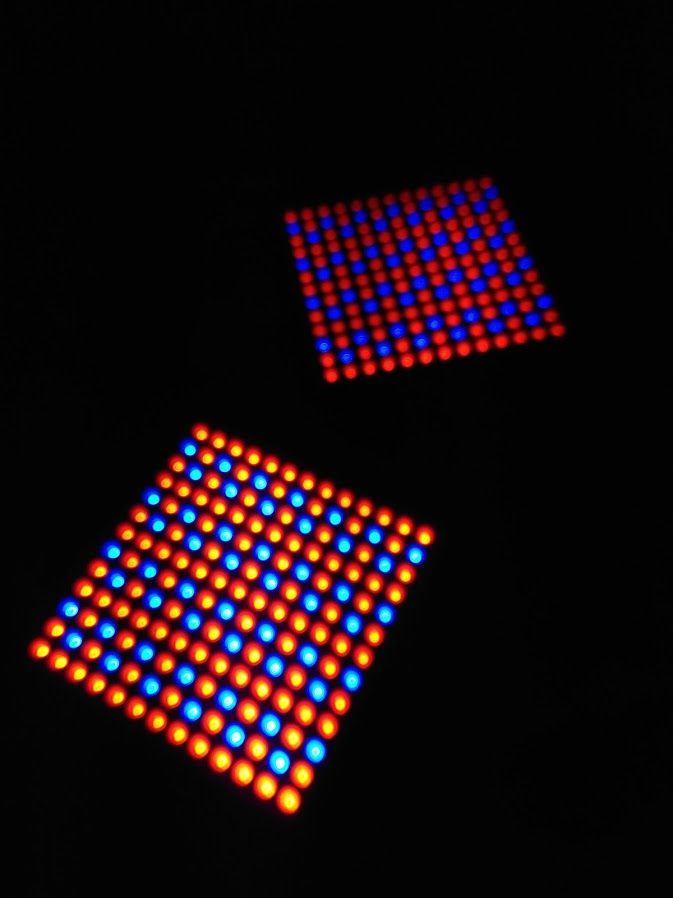

Hay otras que incluyen algunos LED de infrarojo cercano, blanco etc, para dar una diversidad adicional al espectro luminoso que se emite, como en la de esta foto:

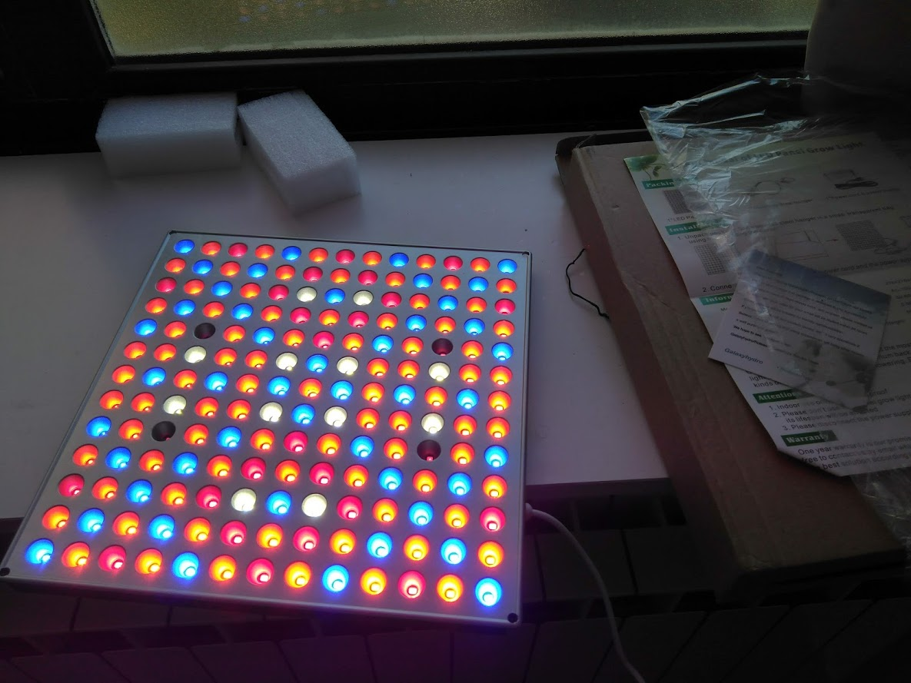

### Panel comercial de 85W a 220V Voltios AC

En este caso tenemos una barra LED, las he visto de varios tamaños: 45, 85 y 110 cm de largo aproximadamente. En nuestro caso utilizo de 85cm. Tiene una altura y un fondo de unos 3cm y no pesan mucho. Se cuelgan del techo mediante hembrillas. Este sistema me ha gustado bastante pero veremos que resultados va dando. Aquí una foto del producto:

Aquí las vemos instalada sobre hembrillas que previamente hemos fijado al techo del módulo:

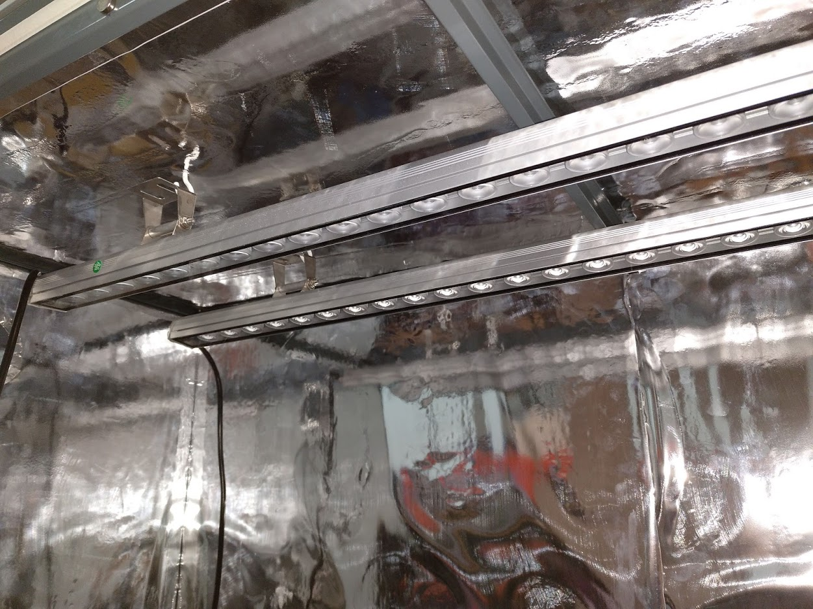

Y aquí las vemos encendida:

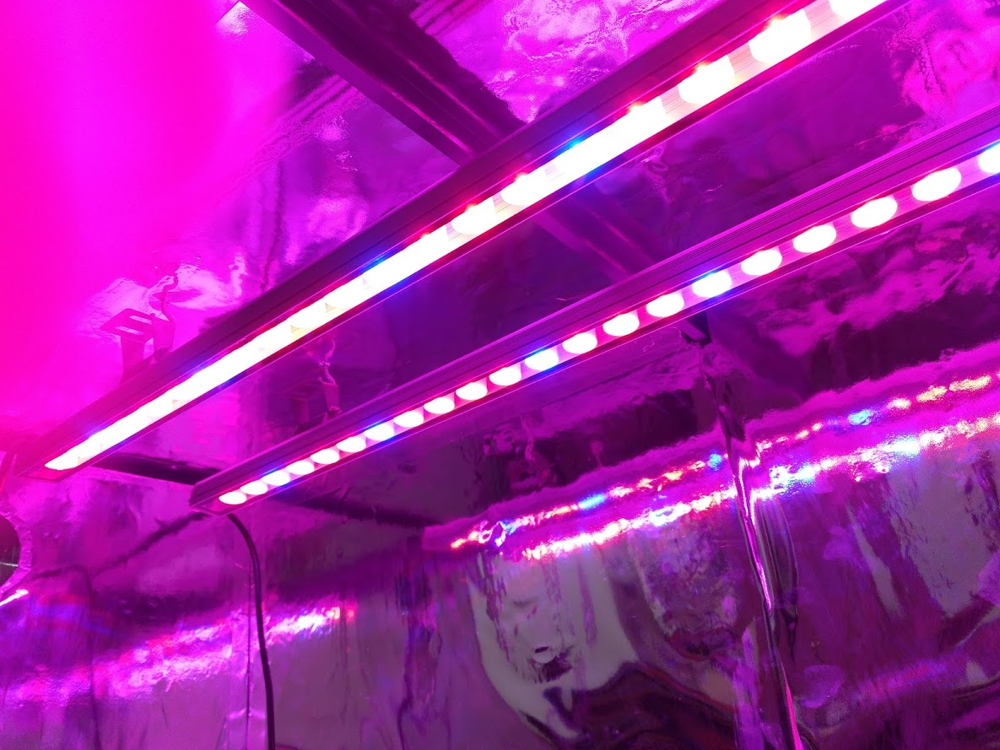

### Panel comercial de 300W a 220V Voltios AC

Este modulo es bastante mas potente y por tanto disipa mas calor. Necesita un buen radiador y ventiladores para disipar este calor. Todo ello está colocado dentro de su caja, lo que hace al conjunto un poco pesado a mi entender. Se pueden unir en **daisy-chain**, es decir, se pueden empalmar varios entre si desde un único enchufe

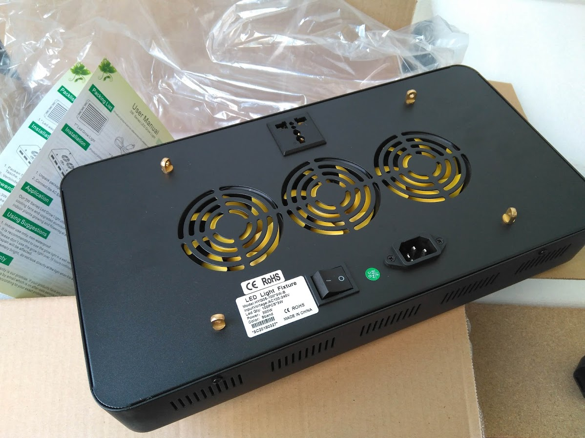

Una prueba de encendido:

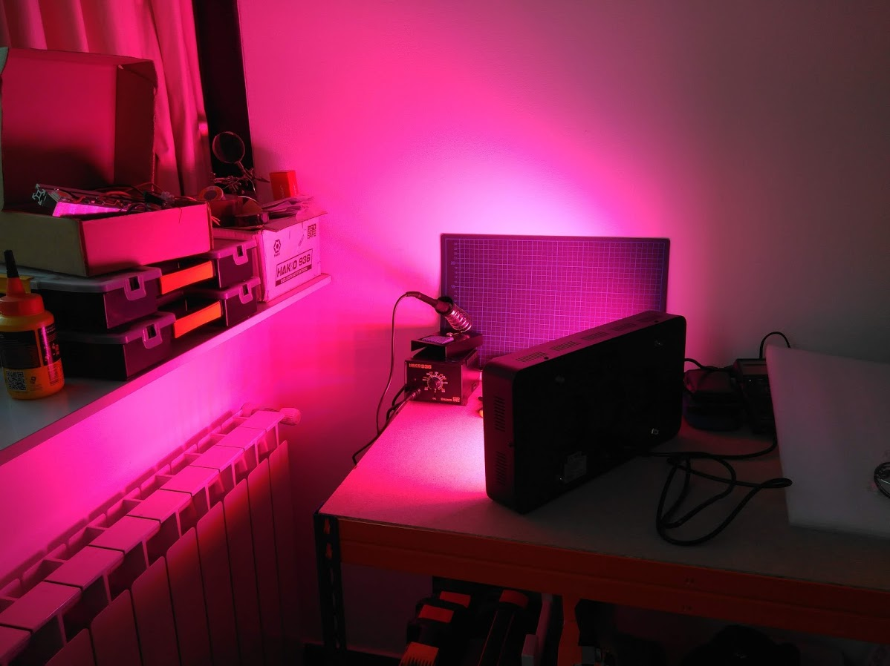

Y aquí lo vemos encendido dentro de un Food Computer:

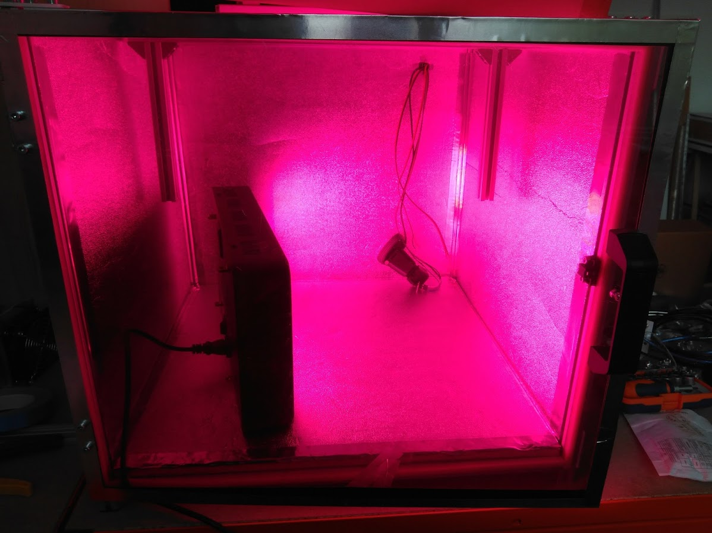

Seguiré experimentando con el tema de luces, pero de momento utilizaré las que os he mostrado.

