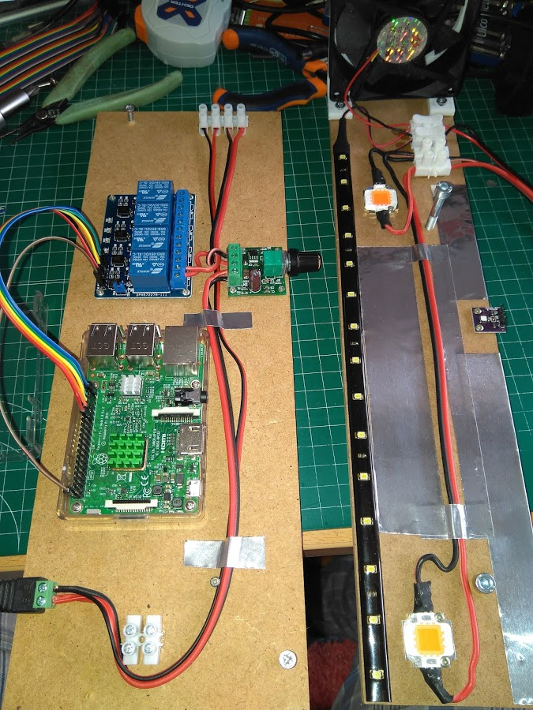
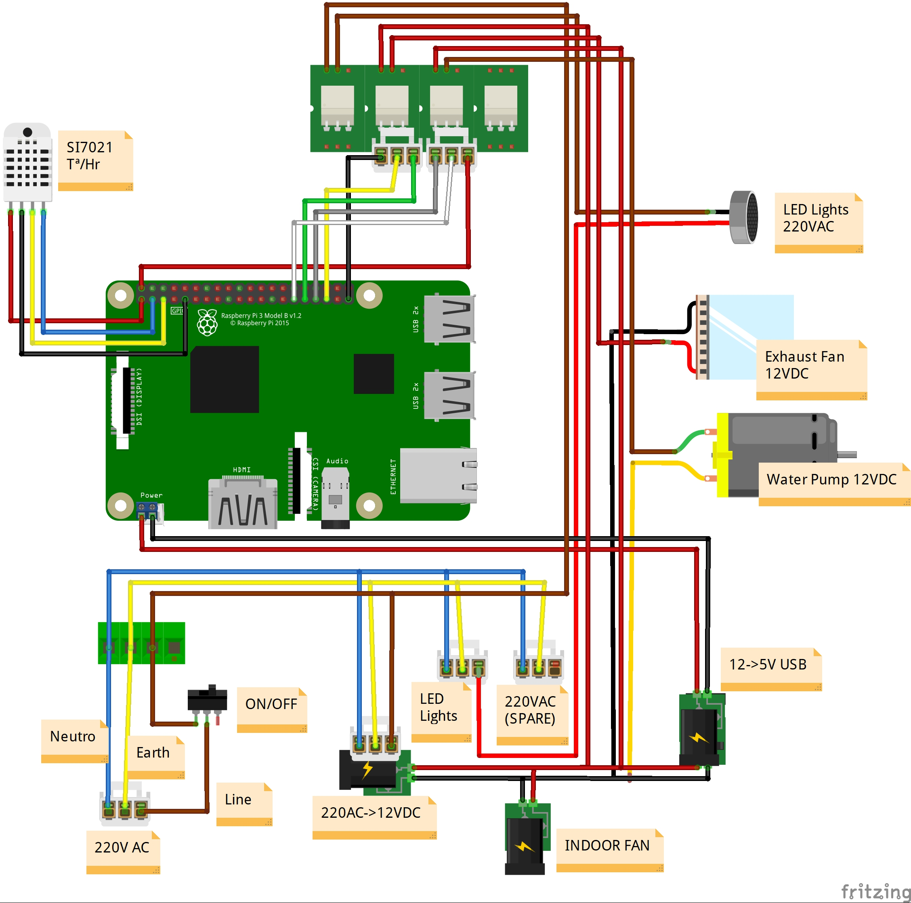
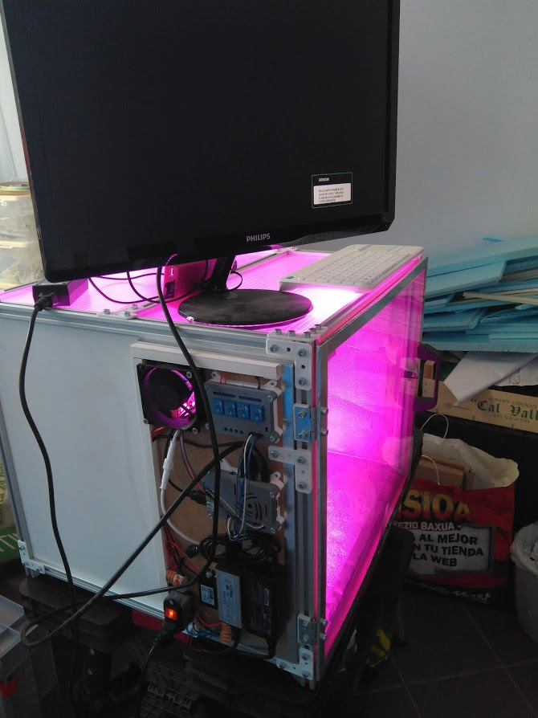
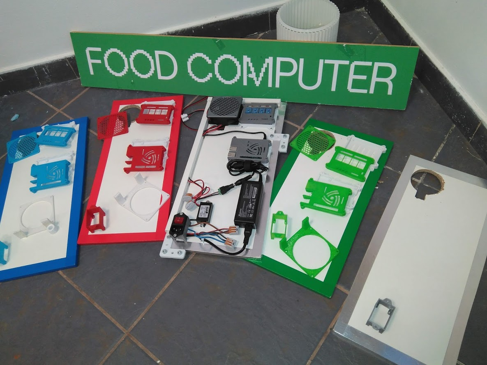
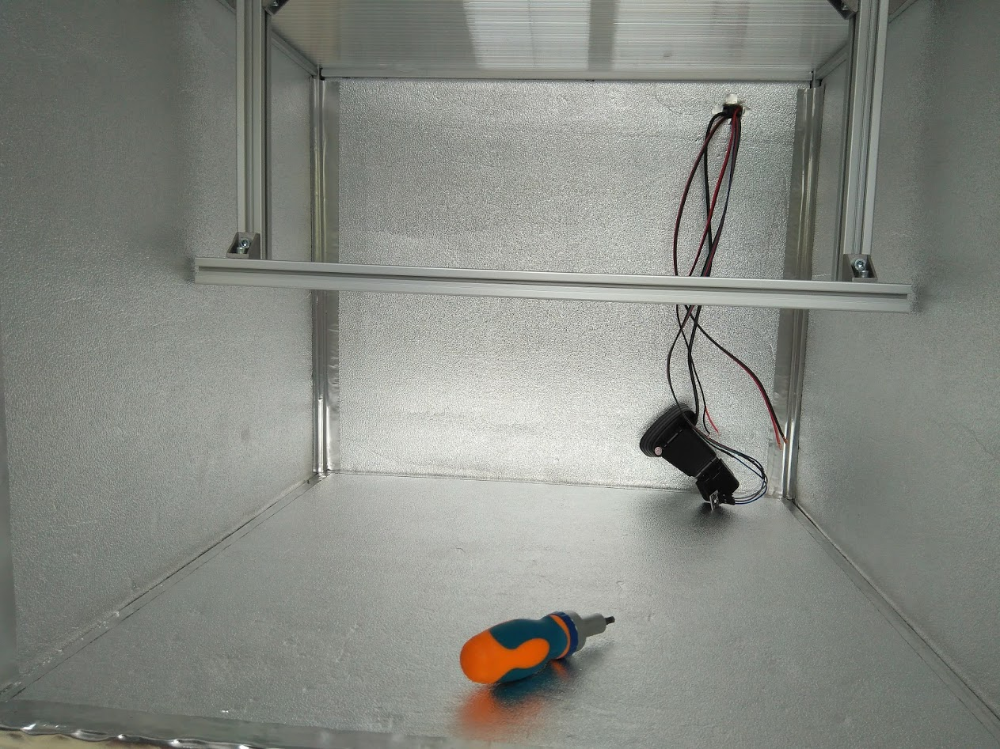
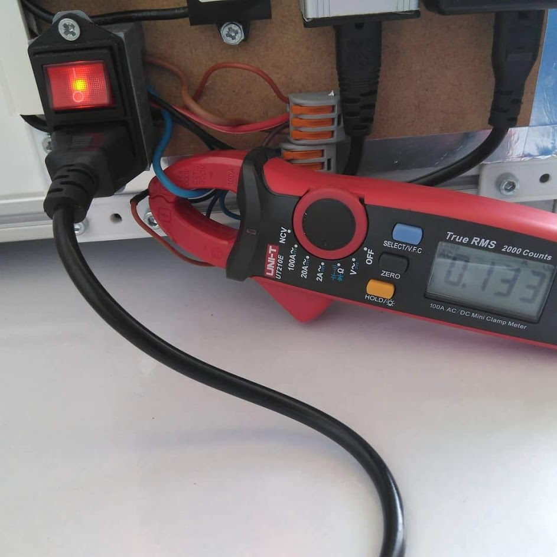

# MVP - Brain

Al inicio del proyecto construí una placa de prueba que tenía este aspecto:

A la izquierda tenemos el microordenador **Raspberry Pi 3** con la tarjeta de 4 relés, conectores y regulador de tension para bajar de 12V a un valor inferior  regulable, en esta época estaba ensayando con LEDs soldados a mano. Es lo que vemos en el módulo derecho. No merece  la pena que lo comente en detalle ya que es una vía que aparqué hace un tiempo y que no recomiendo seguir.

Adjunto aquí un diagrama del aspecto aproximado que debe tener la placa de control. Está realizado con el software abierto **Fritzing**:

El diseño MVP original trabaja con dos de los **4 reles, uno para iluminación y otro para el ventilador que inyecta aire desde el exterior** (cuando la temperatura interior supera un umbral determinado) **En mi diseño se incluye un relé mas, que será para una bomba de 12V para uso de la técnica ebb&flow**. Un relé mas queda de repuesto. Hay otro ventilador siempre conectado a 12V para producir una ventilación interior. Se adaptan los 220V AC a 12V DC para los ventiladores y bomba, de ahí bajamos a 5V USB para la Raspberry, tarjeta de relés y sensor de temperatura/humedad. La iluminación requiere su propia fuente ya que trabaja a tensiones intermedias (normalmente unos 35V DC).

**En esta foto de un Food Computer terminado vemos en el lateral la placa de control unida al chasis**. Todas las piezas están unidas y cubiertas con piezas impresas en 3D que le dan un aspecto mas acabado. La mayor parte del cableado va por canaleta para que no quede a la vista, aunque es inevitable que algo quede visible. Es algo que me gustaría mejorar para futuras versiones:

Aquí vemos varias placas de control en proceso de construcción. Con sus piezas en 3D encima listas para ser ensambladas:

Hay un agujero en el lateral izquierdo para insertar cableado al interior y para entrada del aire del ventilador exterior. En esta foto de una primera versión se colocó la placa en la parte trasera y por ahí se ve la entrada de la cámara USB, sensor de temperatura etc.

**Una cosa que hecho a la hora de poner el cableado es el de dejar suficiente longitud para poder medir consumos de forma no invasiva** mediante una pinza amperímetrica, como vemos en esta foto. Este es el Food Computer que emplea LED de 40W y lo que vemos es el consumo de corriente a 220V. Vemos que en este tipo de FC es bajo. En equipos mas grandes lógicamente se incrementa.

