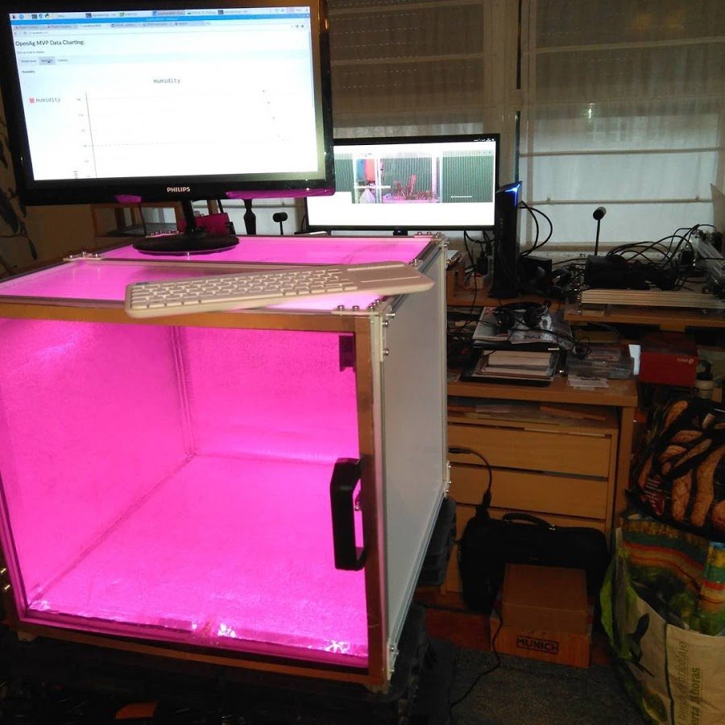

# Food-Computer-a-la-guipuzcoana

## Cultivo de alimentos frescos en espacios reducidos mediante un Food Computer

**Proyecto de crowdfunding con** el apoyo de la **Fundación Goteo**, la **Diputación Foral de Gipuzkoa** y [**48 Patrocinadores**](Cofinanciadores.md). La campaña de captación de fondos comenzó el 14 de Septiembre de 2017 y finalizó el 2 de Diciembre del mismo año, habiendo cumplido el objetivo de financiación. EL proyecto se desarrollará durante el año 2018.

 ## Características principales:

**El Food Computer** es la solución ideal para el **cultivo en espacios reducidos en zonas urbanas**, aprovechando cualquier rincón. Es un proyecto de **hardware abierto**, un mini-invernadero con un control muy intenso de las condiciones de cultivo de tal forma que se puede garantizar el clima adecuado. Se pueden cultivar alimentos frescos de km 0. Durante todo el año, fácilmente y con unas tasas de crecimiento muy altas.

**El sistema es escalable**, de tal forma que Food computer tiene 1m3 pero se pueden hacer equipos mas grandes. El consumo de energía es bajo y es posible obtenerlo por vía renovable. Y todo ello con información abierta y disponible para todas en Internet.

De ese modo se puede cultivar incluso en tierras contaminadas radiactivamente, de hecho el concepto surgió tras una visita a Fukushima de profesorado del MIT. El concepto Food Computer permite conectar vía Internet a otros equipos similares en el mundo, es una especie de red social de agricultores que podrán compartir los parámetros de cultivo o **recetas climáticas** y así conseguir mejorar las cosechas de forma cooperativa y distribuida.

Le quiero añadir funcionalidades que permitan el empleo de biofertilizantes y microorganismos, extracto de agua de mar, etc. Son nutrientes que se pueden crear de forma local y a bajo coste para sustituir a los nutrientes sintéticos que se usan habitualmente en cultivo hidropónico sin tierra. De este modo tendremos un "sustrato vivo" similar al de las tierras mas fértiles y de forma muy asequible y limpia. Integraré también el cultivo de alga spirulina (con una tasa muy elevada de proteínas, calificada de "superalimento").

## Objetivos y recompensas:

Como parte de las recompensas se incluye una unidad de bajo coste y de funciones básicas para comenzar a experimentar, pero el objetivo es construir una unidad completa con todas las funciones y añadir todo lo que se ha comentado. Con ese objetivo cumplido la idea es construir una unidad mas grande de unos 2x2x1m que multiplica las posibilidades. Todo el desarrollo quedará publicado aquí en Github.

## Contenidos de las carpetas:

[**Introducción** ](Introduccion.md) 

Conceptos e Historia del proyecto. Posibilidades que ofrece.

[**Construcción del bastidor** ](Construccion%20bastidor/README.md) 

Varias técnicas constructivas para hacer un bastidor de Food Computer de forma modular, con varios tamaños a elegir.

[**Placa de control - Brain**](Placa%20de%20control%20-%20Brain/README.md) 

Electrónica necesaria para manejar el equipo.

[**Software**](Software/README.md) 

Se utiliza en principio el software **MVP (Minimum Viable Product)**, mas sencillo de implementar y utilizar que el original. 

[**Cultivo**](Cultivo/README.md) 

Metodologías de cultivo.

[**Documentos** ](DOCs/README.md) 

Documentos en formato PDF sobre cultivos de diverso tipo, incluyendo el hidropónico.

[**STLs** ](STL/README.md) 

Ficheros STL listos para imprimir. Necesarios para el desarrollo del proyecto.

[**Varios**](Varios/README.md) 

Diferentes cuestiones que no encajan en el resto de apartados.

## Lista de componentes y presupuesto

El **BOM (Bill of Materials)** está en formato de hoja de calculo excel y tiene varias pestañas que incluye los distintos bastidores realizados y sus diferencias de precio.

En este momento solo está completada la pestaña del FC MVP de 50x50x50 con TSLOT. Próximamente se completará el resto.

El fichero lo tienes [aquí](BOM.xlsx):

## Autor

[**Victor Barahona**](https://github.com/Egokitek)

[**www.egokitek.com**](http://www.egokitek.com)

## Cofinanciadores

[Ver listado **aquí:**](Cofinanciadores.md)

## Créditos

**Food Computer** es un concepto creado por **Caleb Harper** en el **[MIT](http://web.mit.edu/)**, departamento de agricultura abierta **[OpenAg](https://www-prod.media.mit.edu/groups/open-agriculture-openag/overview/)**.

Gran parte de este proyecto está basado en el concepto **[Food Computer MVP](https://forum.openag.media.mit.edu/t/300-food-computer/2343)** (minimum viable product), desarrollado por los miembros de la comunidad OpenAg:
- Peter Webb
- Howard Webb
- Drew Thomas

## Licencia

**GPL3.0**

## En desarrollo actual

- Experimentar y documentar las distintas técnicas de cultivo ya en uso.
- Verificar consumos eléctricos y ver la posibilidad de optimizarlos.
- Probar extracto de agua de mar, biofertilizantes, microorganismos y otros aportes nutricionales.

## Desarrollo futuro

- Integración de cultivo de alga **spirulina**.
- Integración de módulo de **vermicompostaje**.
- Integración de módulo de **acuaponía**.
- Posibilidad de escalado del sistema.

