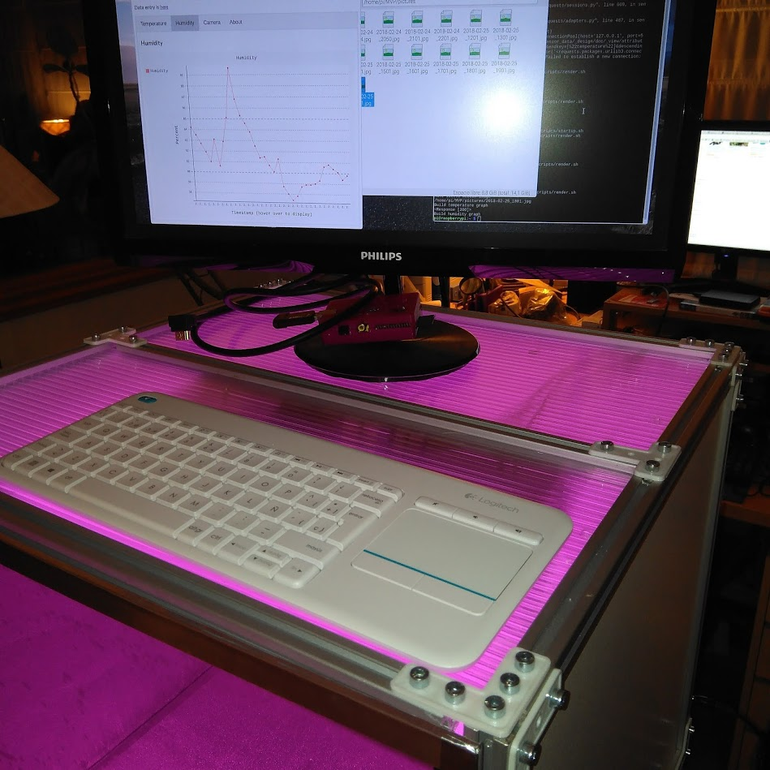
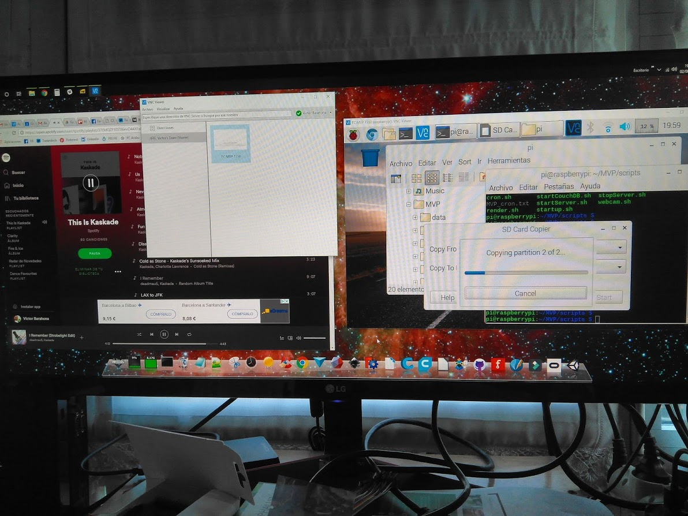
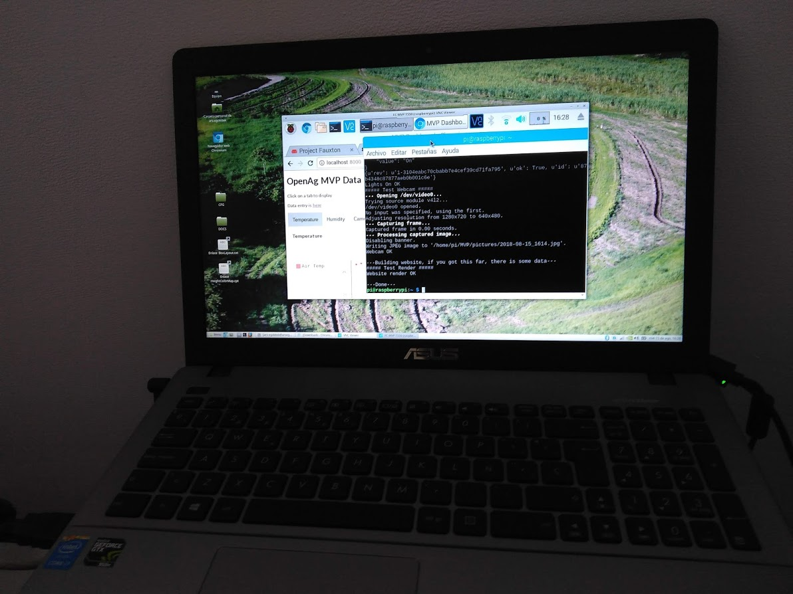

# Software

### Version MVP

Es la que se ha desarrollado en este proyecto y es la que está utilizando la mayoría de la comunidad. **Ha sido desarrollada por Howard & Peter Webb y Drew Thomas.**

Emplea solo un Raspberry Pi3 sin Arduino, con una tarjeta de 4 relés. Corre sobre un sistema **Linux Raspbian (versión Jessie o Strech)**, a la que se ha añadido los scripts en Python que manejan el equipo.

Desde **Crontab** se controlan las tareas de captura de imágenes, encendido y apagado de luces etc. El sistema contiene un software llamado **Couchdb** que permite almacenar los datos capturados y mantenerlos formateados para verse desde un navegador web.

Desde el navegador **Chromium** (equivalente al Chrome) podemos acceder a los datos mediante un interfaz gráfico. En la foto que sigue vemos su aspecto:

Tenemos a la izquierda el navegador con la gráfica de humedad seleccionada. A la derecha una carpeta con una serie de fotos capturadas en timelapse del interior.

**Para facilitar la instalación del software**, desde la comunidad se preparó una imagen de la instalación, si se quema directamente a una SD tendremos el software ya instalado y solo tendremos que modificarlo a nivel de variables de entorno. Como esta imagen pesa cerca de 4Gb no se puede incluir aquí.

Para ver el proceso de instalación paso a paso lo veremos mas abajo.

Una vez de tener **una SD configurada podemos clonarla** mediante una aplicación que tiene el sistema Jessie o Strech, de ese modo ahorraremos bastante tiempo en el proceso. Tal y como vemos en esta foto:

Una vez de instalado el equipo podemos manejarlo mediante teclado y monitor localmente, o bien habilitar en el Raspberry el **VNC Server** (un SW que lleva incluido por defecto) y **de esa manera podemos operar sobre el de forma remota** desde cualquier lugar. Tal y como vemos aquí:

Desde el equipo remoto debemos usar el  software VNC viewer. Para ello debemos abrir una cuenta gratuita que nos permitira conectar desde 3 equipos diferentes a 5 unidades. Yo uso mi móvil, el ordenador que tengo en el taller y el ordenador que tengo en la oficina de mi casa. Y puedo conectar a 5 MVPs. Para mas conexiones ya entramos en el plan de pago. Existen alternativas que estoy estudiando.

La comunidad está trabajando también en algún tipo de UI (Interfaz de usuario) que permite operar en varios equipos de forma remota. Se están valorando aplicaciones IoT como NodeRed, Blynk etc. En mi caso sigo utilizando VNC pero si hago algun avance interesante lo publicaré aquí.

### Instalación paso a paso del software

[**En inglés**](Instalation_FC_MVP_ENG.md) Versión original desarrollada por **Howard Webb**

[**En español**](Instalacion_FC_MVP_ESP.md) Versión traducida al castellano  por **Victor Barahona**

La versión en español incluirá modificaciones para utilizar un tercer relé de bombeo de agua y nutrientes. Está en desarrollo y pruebas.

### Comentarios sobre las versiones V1 y V2 del FC

**Las versiones originales del FC V1 y V2** usaban un **Raspberry Pi3, un Arduino y una placa de hasta 16 relés** para controlar los actuadores. Además del software de Arduino la placa Raspberry llevaba su propio software con scripts en JSON y Python. 

Algunos de los problemas que han llevado al abandono de esta línea de trabajo en MArzo de 2018 es la interconectividad de todo este software, problemas con las lecturas de sensores que tenían diferentes tipos de conectores y tensiones de trabajo.

También se comprobaron problemas con la estabilidad del Raspberry Pi debido a que no tiene propiamente un disco duro sino una tarjeta SD que contiene el sistema. Las sucesivas operaciones de lectura/escritura en la misma provocaban una corrupción de datos. Si esta se producía en algún fichero crítico del sistema éste se quedaba "colgado".

### Comentarios sobre la versión V3 EDU

**La nueva V3 EDU** lanzada en Noviembre de 2018 utiliza el **BeagleBone Black Wireless** , una placa que incluye una memoria interna de 4GB que contiene el sistema y es mucho mas robusta, con un slot para micro SD donde se guardan los datos. No se incluye Arduino.

En esta nueva versión tampoco hay placas de relés estandar sino una placa a medida donde se inserta el Beaglebone. En esa placa están insertos los drivers y circuitería necesaria para operar todo el sistema. Los planos e han liberado en Noviembre de 2018 y todavía se está discutiendo en la comunidad la manera mas económica de poder fabricarla, ya que al ser de 30x30 cm su producción es bastante costosa.

