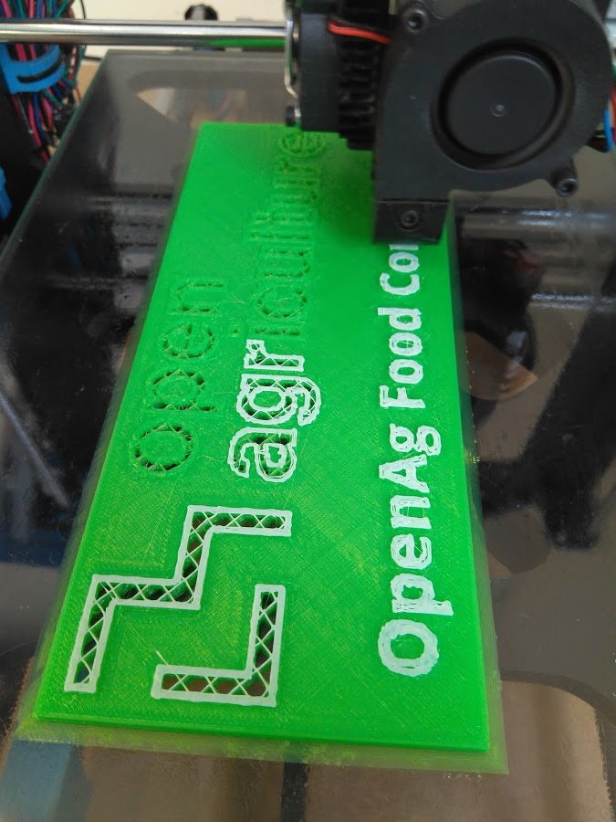
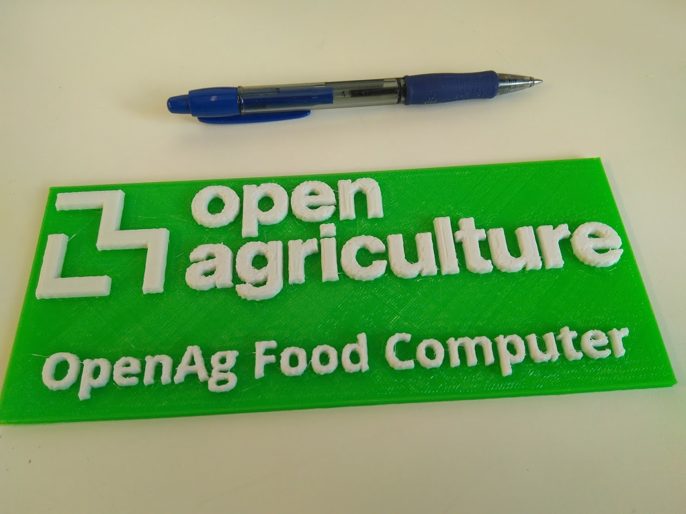
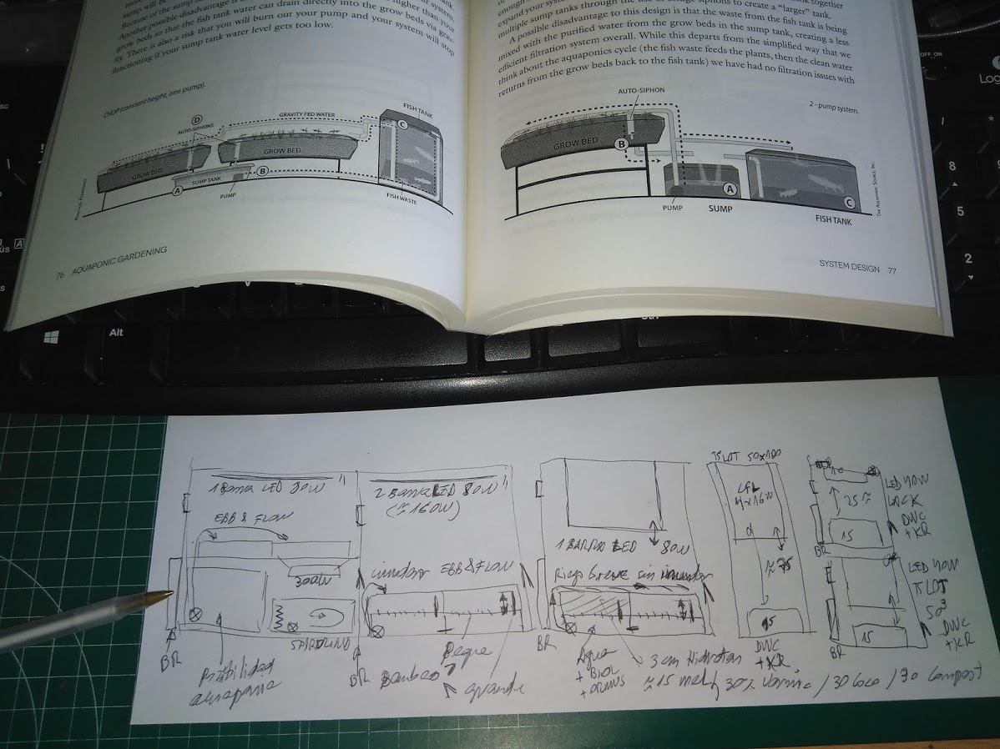
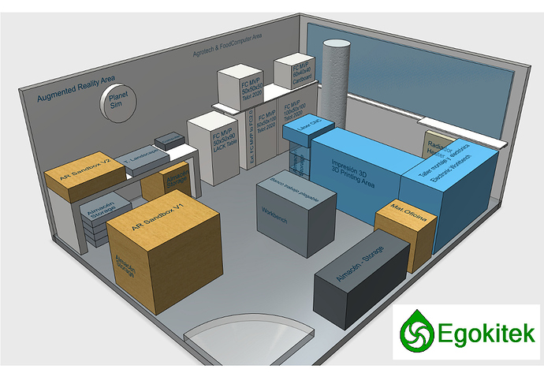
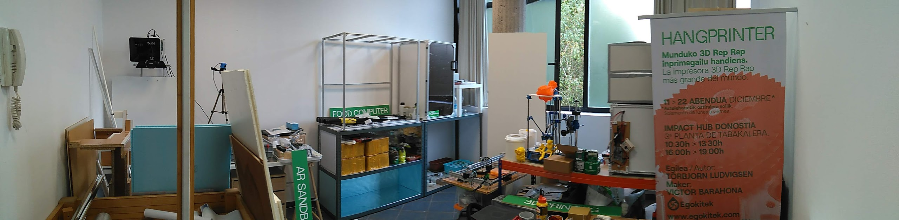
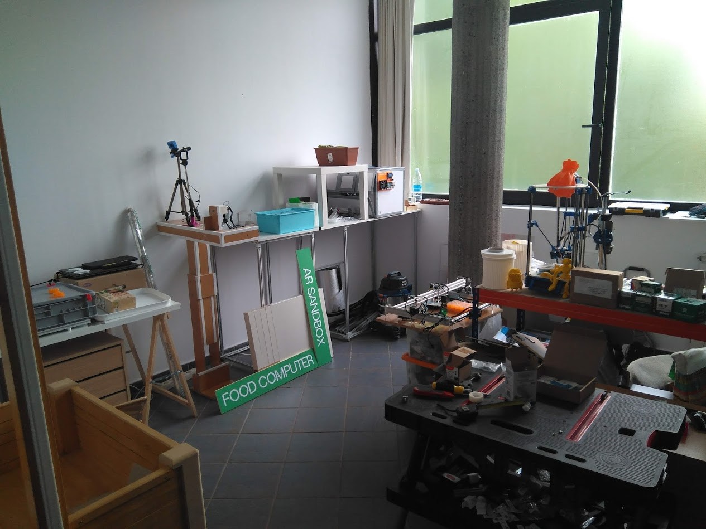
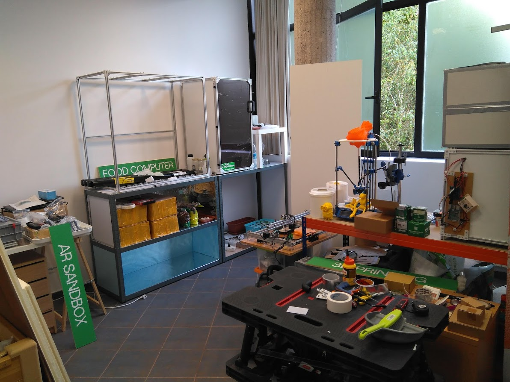
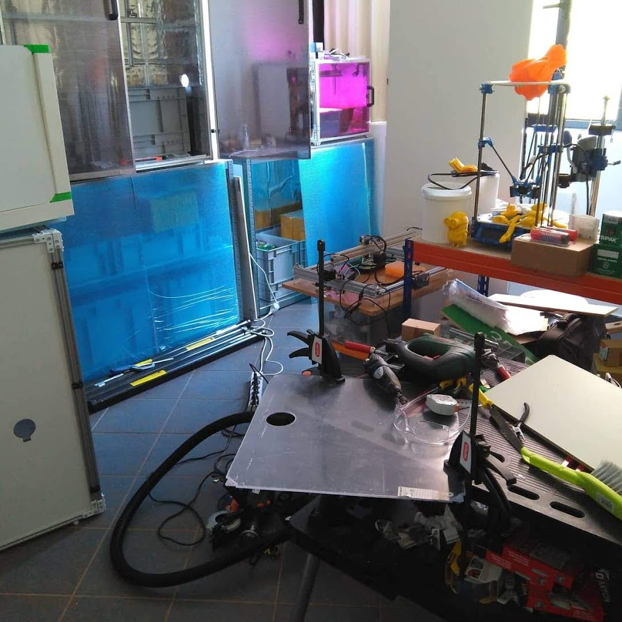
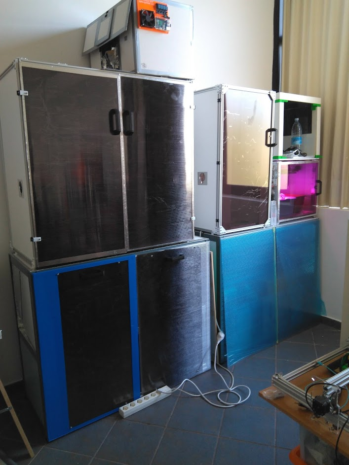
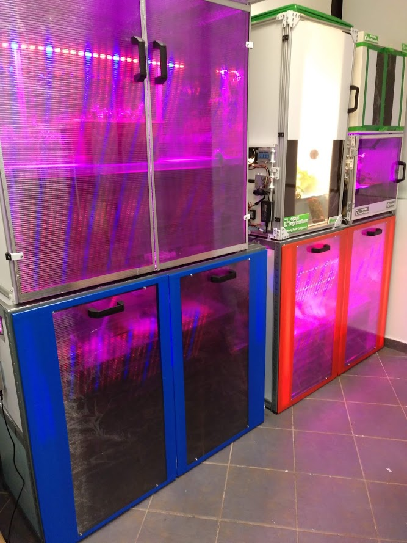

# Varios

Incluyo aquí imágenes del desarrollo del proyecto que no encajan en el resto de apartados y son  **off-topic**

## Impresión 3D de piezas para el proyecto

En la carpeta **STL** están los ficheros correspondientes. Algunos de ellos están impresos a dos colores para mejorar el contraste y acabado. Como vemos aquí:

 

En la foto se ve justo el momento en que comienza a imprimir con el segundo color. Una vez terminada la pieza queda así:

 

## Diseñando la granja indoor

Para desarrollar el proyecto he estudiado diferente bibliografía, como este libro sobre **acuaponía**. Debajo vemos un croquis de la granja. Luego ha ido evolucionando.

 

## El taller

El proyecto lo he desarrollado en un taller de 20m2 que tengo en alquiler en un centro de empresas de **Donostia-San Sebastian**. Aquí trabajo en varios campos y no solo en Food Computers. Aquí vemos un croquis del taller cuando estaba instalando los equipos.

 

Y aquí una panorámica del taller hace unos meses, está en constante evolución:

 

## Evolución de la granja indoor

Algunas fotos para ir viendo el progreso:

 

 

 

 

 

